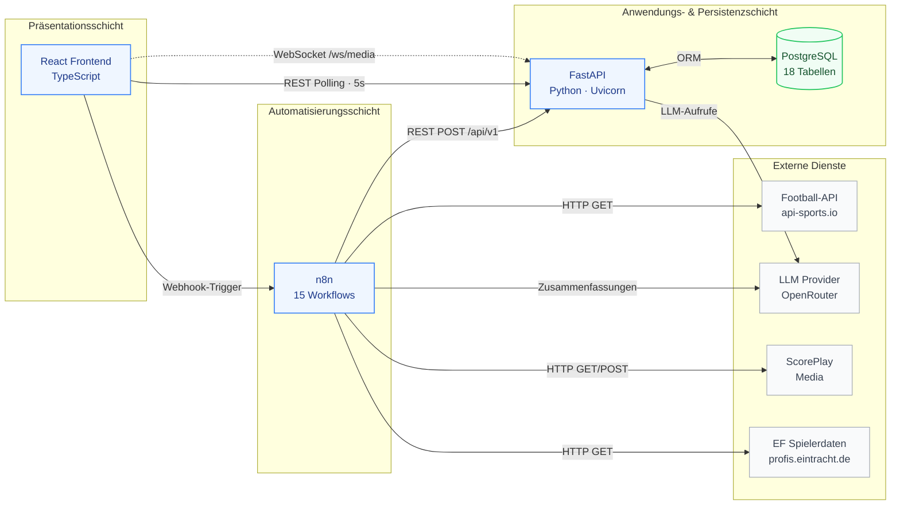
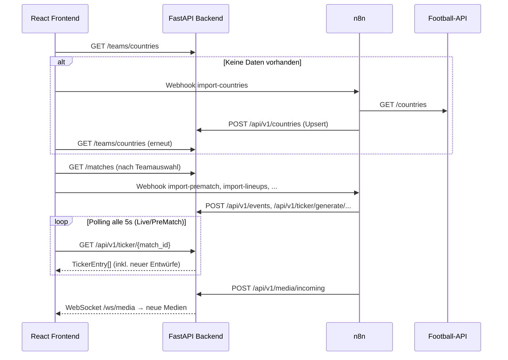
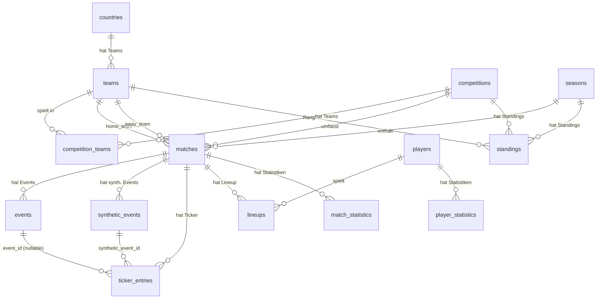
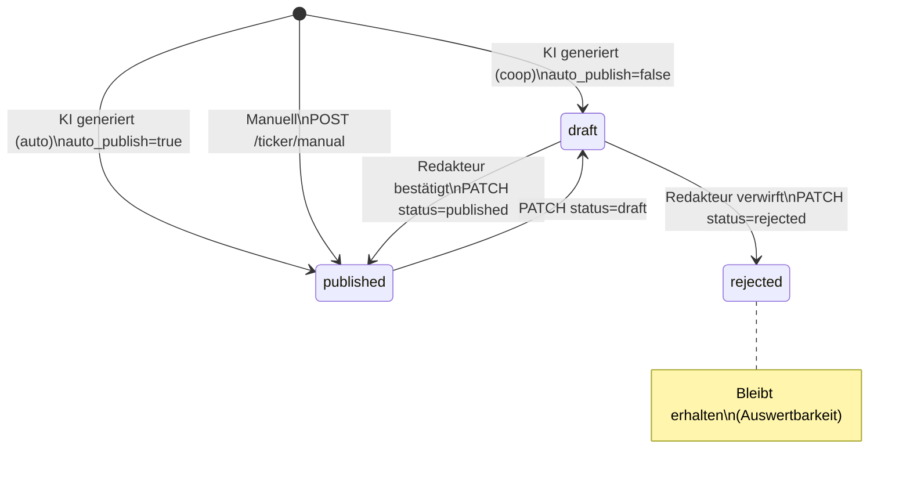
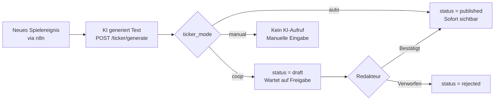
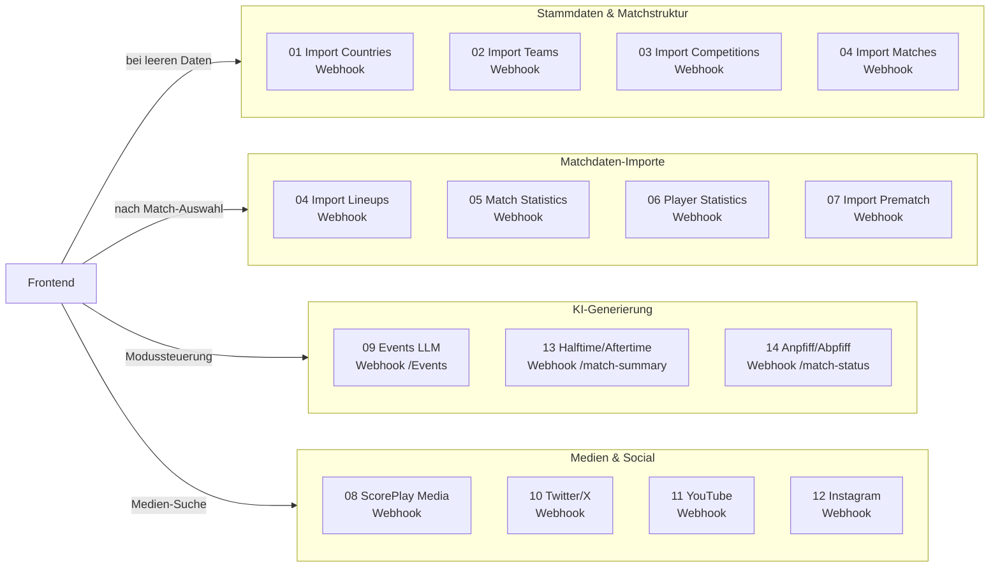
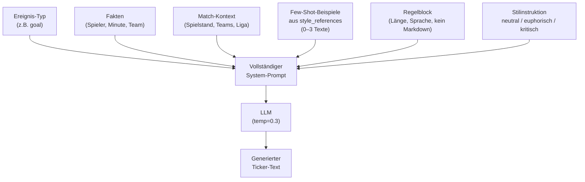
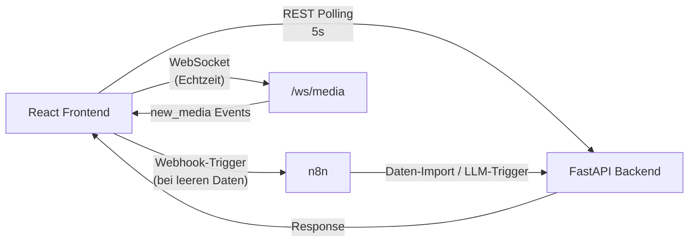

# Kapitel 4 – Systemkonzeption

---

## 4.1 Überblick und Schichtenmodell

Das System ist als **eigenständiger Cloud-Service** konzipiert, der alle Spiele der konfigurierten Wettbewerbe automatisch verarbeitet — von der Datenimportierung über die KI-Textgenerierung bis zur Publikation. Es ist eine serviceorientierte, dreischichtige Architektur, die Datenbeschaffung, Anwendungslogik und Präsentation klar voneinander trennt. Diese Schichtentrennung folgt dem etablierten Prinzip der _Separation of Concerns_ (Parnas 1972), das die unabhängige Weiterentwicklung einzelner Systemteile ermöglicht. Zusätzlich exportiert das System publizierte Inhalte über dedizierte n8n-Workflows an die bestehende **Stackwork Demo App** von Eintracht Frankfurt (vgl. Abschnitt 4.1.3).

Die **Datenbeschaffungs- und Automatisierungsschicht** wird über n8n umgesetzt. Sie integriert externe Datenquellen (insbesondere Football-API sowie Medienquellen wie ScorePlay und Social-Feeds), transformiert die Rohdaten in ein einheitliches internes Format und schreibt diese strukturiert in die Persistenzschicht beziehungsweise über definierte Backend-Endpunkte in das System ein. Die Entkopplung der Integrationslogik in n8n ermöglicht eine schnelle Anpassung von Import-Workflows, ohne den Anwendungskern ändern zu müssen.

Die **Anwendungs- und Persistenzschicht** basiert auf FastAPI (Python) und PostgreSQL. Sie stellt die REST-Schnittstellen bereit, verwaltet den Zustandsübergang der Ticker-Einträge (z. B. draft, published, rejected), orchestriert KI-Generierungsschritte und übernimmt die konsistente Speicherung aller Domänendaten (u. a. Teams, Wettbewerbe, Spiele, Events, Statistiken, Ticker- und Media-Daten).

Die **Präsentationsschicht** ist als White-Label-Frontend in React realisiert. Sie bildet den Redaktionsworkflow für Auswahl, Sichtung, Bearbeitung und Publikation ab und bleibt dabei mandantenfähig konfigurierbar (z. B. Instanz, Stil, Sprache, Branding). Technisch kombiniert das Frontend REST-basiertes Polling für Ticker- und Spieldaten mit einem dedizierten WebSocket-Kanal für Echtzeit-Medienupdates.

Die folgende Abbildung zeigt die drei Schichten mit ihren Technologien und Kommunikationspfaden:

---

### 4.1.1 Kommunikations- und Triggerarchitektur

Der Kommunikationsfluss folgt dem Prinzip **„read first, trigger if missing"**: Das Frontend liest zunächst den vorhandenen Datenbestand über REST; nur bei fehlenden Daten wird ein passender n8n-Webhook ausgelöst. Dadurch werden externe API-Aufrufe minimiert und redundante Importe vermieden.

Die Systemkopplung erfolgt über drei klar getrennte Schnittstellentypen:

- **REST-API** — stabiler Kern für alle Lese- und Schreiboperationen: Navigation, Ticker-CRUD, Statusübergänge (`draft` → `published` → `rejected`), manuelle Eingaben.
- **n8n-Webhooks** — bedarfsgesteuerte Trigger für drei Klassen:
  1. **Initialisierungs-Trigger** — Aufbau fehlender Stammdaten (Länder, Teams, Wettbewerbe, Spiele)
  2. **Match-Kontext-Trigger** — spielbezogene Importe nach Matchauswahl (Events, Lineups, Statistiken, Prematch)
  3. **Generierungs-Trigger** — Anstoß von KI-Textprozessen (Event-basiert, Matchphasen, Zusammenfassungen)
- **WebSocket `/ws/media`** — Echtzeit-Push für latenzkritische Medieninhalte (ScorePlay-Bilder, Social-Media-Clips); Ticker- und Matchdaten bleiben bewusst im Polling-Modell.

Diese hybride Triggerarchitektur unterstützt sowohl redaktionelle Kontrolle im Sinne eines **Human-in-the-Loop**-Ansatzes (Monarch 2021, S. 8) als auch weitgehend automatisierte Live-Prozesse.

---

### 4.1.2 Partner-Team-Konzept und White-Label-Steuerung

Das System unterscheidet zwischen dem **Partner-Team** — dem Verein, für den die White-Label-Instanz konfiguriert ist — und den jeweiligen Gegnern. Diese Unterscheidung wird über ein konfigurierbares Team-Keyword umgesetzt, das sowohl in den n8n-Workflows als auch im Frontend gegen den Teamnamen abgeglichen wird.

Auf Basis dieser Erkennung werden zwei Verarbeitungspfade gesteuert:

- **Instanz und Stil**: Partner-Team-Spiele verwenden den `ef_whitelabel`-Instanzpfad mit euphorischem Stil; alle anderen Spiele den `generic`-Pfad mit neutralem Stil.
- **UI-Anpassung**: Das Frontend blendet vereinsspezifische Bereiche (Social-Media-Panels, Torjubel-Videos) ausschließlich bei erkannten Partner-Team-Spielen ein.
- **Erweiterte Kontextdaten**: Für Tormomente des Partner-Teams werden zusätzlich Spielerdaten und Torjubel-Video-URLs aus einer externen Vereinsquelle in den Prompt-Kontext eingebettet.

Das Datenbankschema enthält ergänzend ein `is_partner_team`-Flag, das für zukünftige Erweiterungen vorgesehen ist. Die konkreten SQL-Abfragen und Code-Implementierungen sind in Kapitel 5.7.1 dokumentiert.

---

### 4.1.3 Export zur Stackwork Demo App

Das entwickelte System ist als **eigenständige Anwendung** konzipiert. Publizierte Ticker-Einträge können über dedizierte n8n-Export-Workflows an die bestehende **Stackwork Demo App** von Eintracht Frankfurt übertragen werden — beide Systeme operieren vollständig getrennt, es findet keine Code-Integration statt. Der Autor hat als Mitarbeiter der Stackwork GmbH Zugang zu den CMS-API-Endpunkten der Demo App, jedoch nicht zum Quellcode oder der Infrastruktur.

---

## 4.2 Backend-Konzeption

### 4.2.1 Framework-Wahl: FastAPI

Als Backend-Framework wurde FastAPI gewählt (vgl. Abschnitt 3.6.2 für die technische Einordnung). Die Entscheidung begründet sich durch drei systemspezifische Anforderungen: Erstens erfordert die parallele Verarbeitung von LLM-Aufrufen, externen API-Abfragen und Medienverarbeitung native Unterstützung für asynchrone I/O. Zweitens vereinfacht die automatisch generierte OpenAPI-Spezifikation die Integration mit n8n-Workflows erheblich, da Endpunkte über Swagger UI direkt testbar sind. Drittens reduziert die enge Pydantic-Integration Schnittstellenfehler zwischen Frontend, Backend und n8n, indem alle Eingaben gegen typisierte Schemas validiert werden.

---

### 4.2.2 Interne Struktur und Datenzugriff

Die interne Struktur folgt einer klaren Trennung aus API-Routern, Repository-Schicht (vgl. Kap. 3.6.3) sowie **SQLAlchemy 2.0**-ORM-Modellen und Pydantic-Schemas. Die Router bilden die HTTP-Schnittstelle und übernehmen Validierung, Statuscodes sowie die Orchestrierung einzelner Use Cases. Datenbankzugriffe sind in dedizierten Repositories gekapselt. Dadurch bleibt die API-Schicht frei von SQL-Details, während Persistenzlogik zentral gebündelt und wiederverwendbar gehalten wird.

Für LLM-nahe Abläufe wird ergänzend eine Service-Schicht genutzt (insbesondere `ticker_service` und `llm_service`). Die Service-Schicht wird dabei gezielt, aber nicht flächendeckend eingesetzt: Viele Standard-CRUD- und Listenoperationen folgen dem Muster Router → Repository, während komplexere Generierungs- und Orchestrierungspfade über Services laufen.

Für die Datenrepräsentation gilt eine bewusste Trennung: ORM-Modelle definieren die Persistenzstruktur, Pydantic-Schemas die API-Verträge. Das stabilisiert die Schnittstellen gegenüber internen Refactorings und verbessert Wartbarkeit und Testbarkeit.

---

### 4.2.3 API-Design und Endpunktstrategie

Die Backend-Schnittstelle ist als versionierte REST-API unter `/api/v1` ausgelegt und orientiert sich am Architekturstil **Representational State Transfer** (Fielding 2000, Kap. 5). Endpunkte sind ressourcenorientiert strukturiert (z. B. `teams`, `matches`, `ticker`, `media`, `clips`) und folgen konsistenten Benennungs- und Methodenregeln. `GET` dient lesenden Abfragen, `POST` dem Erzeugen bzw. Triggern, `PATCH` partiellen Zustandsänderungen und `DELETE` kontrollierten Löschoperationen. Insbesondere im Ticker-Kontext bildet `PATCH` den redaktionellen Lebenszyklus (`draft` → `published` bzw. `rejected`) explizit ab.

Konzeptionell wird zwischen fachlichen Datenendpunkten und prozessualen Triggerendpunkten getrennt. Dadurch bleiben Leseoperationen seiteneffektfrei, während Import- und Generierungsprozesse gezielt ausgelöst werden können. Fehlerfälle werden konsistent über HTTP-Statuscodes und strukturierte Fehlermeldungen kommuniziert, sodass Frontend und n8n-Workflows deterministisch reagieren können.

---

### 4.2.4 Asynchronität, Nebenläufigkeit und Performance

Die Laufzeitkonzeption setzt Asynchronität gezielt auf I/O-intensiven Pfaden ein, insbesondere bei LLM-bezogenen Generierungsrouten, Media-Verarbeitung und WebSocket-Kommunikation. Das erhöht die Reaktionsfähigkeit unter paralleler Last, da Wartezeiten auf externe Dienste keine Worker dauerhaft blockieren.

Die Anzahl gleichzeitiger LLM-Aufrufe wird über einen konfigurierbaren **Semaphore-Mechanismus** begrenzt (Standard: 8 parallele Anfragen). Diese Begrenzung reduziert Lastspitzen und verringert die Wahrscheinlichkeit von Rate-Limit-Problemen seitens der LLM-Provider. Der Semaphore wirkt dabei pro Prozessinstanz — bei horizontaler Skalierung steigt die effektive Gesamtkonkurrenz entsprechend der Anzahl laufender Instanzen.

Die Implementierung ist bewusst hybrid aus synchronen und asynchronen Pfaden aufgebaut. Nicht alle Endpunkte sind vollständig asynchronisiert; stattdessen wurde ein pragmatischer Kompromiss zwischen Performance, Komplexität und Wartbarkeit gewählt. Langlaufende Integrationslogik ist in n8n ausgelagert, wodurch der API-Server als transaktionaler Kern entlastet wird.

---

### 4.2.5 Fehlerbehandlung, Robustheit und Betriebsaspekte

Für den Live-Betrieb wurde das Backend auf robuste Fehlerbehandlung und kontrollierte Degradation ausgelegt. Fehler werden über konsistente HTTP-Antworten und strukturierte Meldungen zurückgegeben, sodass Frontend und n8n-Workflows differenziert reagieren können.

Die Datenpersistenz ist auf **idempotente Verarbeitung** ausgelegt (vgl. Kap. 4.3.4 für Details zu Upsert-Strategien und Schlüsseldesign). Bei Teilausfällen externer Dienste bleibt das System eingeschränkt funktionsfähig — bereits persistierte Daten bleiben verfügbar, redaktionelle Kernprozesse (z. B. manuelle Tickererstellung) können fortgeführt werden.

Ergänzend sichern Health-Checks, Logging, CORS-Konfiguration und klare Schnittstellentrennung die Betriebs- und Diagnosefähigkeit.

---

### 4.2.6 Sicherheitskonzept

Das System adressiert Sicherheit auf drei Ebenen, wobei der Projektrahmen einer Bachelorarbeit eine bewusste Priorisierung erfordert:

**Transportebene:** Die gesamte Kommunikation zwischen Frontend, Backend und externen Diensten erfolgt über HTTPS. Die Render-Plattform übernimmt die TLS-Terminierung und Zertifikatsverwaltung automatisiert.

**API-Absicherung:** Der Backend-Server konfiguriert eine **CORS-Whitelist** (Cross-Origin Resource Sharing), die Anfragen ausschließlich von autorisierten Frontend-Ursprüngen akzeptiert. Die API-Schlüssel externer Dienste (LLM-Provider, API-Football, ScorePlay) werden über Umgebungsvariablen injiziert und sind weder im Quellcode noch im Frontend exponiert. Die Pydantic-basierte Eingabevalidierung (vgl. Kapitel 3.6.2) schützt zusätzlich vor Injection-Angriffen, da sämtliche Request-Payloads gegen typisierte Schemas geprüft werden, bevor sie die Geschäftslogik erreichen.

**Authentifizierung und Autorisierung:** Eine feingranulare Benutzerauthentifizierung mit Rollenkonzept (z. B. Redakteur, Administrator) ist im aktuellen Stand **nicht implementiert**. Das System ist als internes Redaktionswerkzeug konzipiert und setzt auf Netzwerksegmentierung statt individueller Zugangskontrolle. Für einen produktiven Mehrbenutzerbetrieb wäre die Integration eines Authentifizierungsframeworks (z. B. OAuth 2.0 oder JWT-basierte Token-Authentifizierung) erforderlich — dies wird in Kapitel 7 als Erweiterungsperspektive eingeordnet.

---

## 4.3 Datenbankkonzeption

Die Persistenzschicht basiert auf PostgreSQL und umfasst in der aktuellen Fassung **18 Tabellen**. Das Schema ist auf einen stabilen Live-Betrieb mit wiederholbaren Importen, klaren Zustandsübergängen und nachvollziehbaren Redaktionsentscheidungen ausgelegt.

### 4.3.1 Schemadesign-Prinzipien

Das Datenbankschema umfasst 18 Tabellen (17 ORM-Modelle sowie eine schlüsselwertbasierte `settings`-Tabelle, die ausschließlich über eine Alembic-Migration verwaltet wird). Die folgende Abbildung zeigt die zentralen Entitäten und ihre Beziehungen:

> **Hinweis:** Die Tabellen `media_queue`, `media_clips`, `style_references` und `settings` sind als eigenständige Entitäten ohne Fremdschlüsselbeziehungen modelliert und daher im ER-Diagramm nicht abgebildet. `style_references` dient als Few-Shot-Datenquelle für die LLM-Promptgenerierung; `media_queue` wird applikationsseitig über die Media-Endpunkte verwaltet.

Das Schema folgt einem hybriden Entwurfsansatz aus strukturierter Normalisierung und gezielter Schemaflexibilität:

1. **Normalisierte Kernentitäten** — Zentrale Domänenobjekte wie `teams`, `matches`, `events`, `ticker_entries`, `players`, `competitions` und Zuordnungstabellen sind in dritter Normalform modelliert (Codd 1970). Dadurch bleiben Beziehungen, Integrität und Auswertbarkeit im Live-Betrieb stabil.
2. **Gezielter JSONB-Einsatz** — JSONB wird bewusst nur dort eingesetzt, wo sich Strukturen dynamisch ändern oder kontextabhängig sind (z. B. `synthetic_events.data`, sowie mehrere Kontextfelder in `matches`). Die Statistiktabellen (`match_statistics`, `player_statistics`) sind dagegen bewusst stark typisiert über explizite Spalten modelliert, um konsistente Abfragen und robuste Aggregationen zu ermöglichen.
3. **Schlüsselstrategie: Integer-PK + UUID-Fachschlüssel** — Das Schema verwendet numerische Primärschlüssel (`id`) für performante Joins und Fremdschlüsselbeziehungen. Zusätzlich existiert in mehreren Kernentitäten ein eindeutiges `uid`-Feld (UUID) als stabiler externer Referenzschlüssel. Es handelt sich damit nicht um ein reines UUID-Primary-Key-Schema, sondern um eine kombinierte Strategie.

---

### 4.3.2 Status-Lifecycle der Ticker-Einträge

Jeder Ticker-Eintrag in `ticker_entries` folgt einem klaren Statusmodell mit drei Zuständen:

- **`draft`**: Entwurf, noch nicht freigegeben
- **`published`**: redaktionell oder automatisch veröffentlicht
- **`rejected`**: verworfen, bleibt zur Nachvollziehbarkeit erhalten

Ergänzend markiert das Feld `source` die Herkunft (`ai` vs. `manual`) und erlaubt eine saubere Trennung für Evaluationen (z. B. ausschließlich KI-generierte Einträge).

> **Hinweis für die Methodik**: Im aktuellen Schema ist kein separates `published_at`-Feld vorhanden. Persistiert wird `created_at` des jeweiligen Ticker-Eintrags. Für sekundengenaue Time-to-Publish-Analysen sind daher zusätzliche Messzeitpunkte im Evaluationsdatensatz bzw. in der Messlogik erforderlich, statt sich allein auf den Tabellenzustand zu stützen.

---

### 4.3.3 Die drei Betriebsmodi

Das Feld `ticker_mode` in `matches` steuert das Verhalten der Generierungspipeline pro Spiel und ist zur Laufzeit umschaltbar über `PATCH /api/v1/matches/{id}/ticker-mode`. Es sind drei Modi implementiert:

1. **`auto`** (vollautomatisch) — Triggerkette läuft ohne redaktionellen Eingriff; KI-Ergebnisse werden direkt veröffentlicht.
2. **`coop`** (kooperativ / Human-in-the-Loop) — KI erzeugt Entwürfe (`draft`), die Redaktion entscheidet über Veröffentlichung oder Ablehnung. Dieser Modus bildet das primäre Zielbild des Systems.
3. **`manual`** (rein redaktionell) — Einträge werden manuell erstellt; KI-Generierung ist nicht leitend für den Veröffentlichungsprozess. Dieser Modus dient als Referenz für Vergleiche in der Evaluation.

Damit wird der Moduswechsel als Laufzeitparameter auf Datenbankebene abgebildet, ohne Deploy oder Neustart des Systems.

---

### 4.3.4 Integrität, Idempotenz und Auswertbarkeit

Für den Zusammenschluss aus n8n-Workflows, externen APIs und Backend-Routen ist die Datenbank auf idempotente Verarbeitung ausgelegt:

1. **Konfliktarme Wiederholbarkeit** — Wiederholte Imports führen durch Unique-Constraints und Upsert-Strategien nicht zu unkontrollierten Duplikaten.
2. **Eindeutige Zuordnung in zentralen Tabellen** — Eindeutige Schlüssel (z. B. `source_id` pro Ereignisquelle) sichern die Nachvollziehbarkeit importierter Ereignisse.
3. **Referenzielle Integrität über FK-Regeln** — Lösch- und Nullsetz-Strategien (`CASCADE`, `SET NULL`) sorgen dafür, dass abhängige Daten konsistent bleiben und Historie dort erhalten wird, wo sie fachlich relevant ist.
4. **Auswertungskompatibilität** — Die Kombination aus `ticker_mode`, `status`, `source`, Spielbezug und Zeitfeldern schafft die Grundlage für reproduzierbare Vergleichsauswertungen zwischen manuellen, kooperativen und automatisierten Abläufen.

---

## 4.4 Workflow-Konzeption (n8n)

Die Workflow-Schicht ist als entkoppelte Orchestrierungsebene zwischen externen Datenquellen und Backend ausgelegt. n8n übernimmt dabei API-Aufrufe, Transformation, Persistenzvorbereitung und Triggersteuerung, während das FastAPI-Backend als transaktionaler Kern und Integrationspunkt für Frontend und KI-Generierung fungiert.

### 4.4.1 Workflow-Klassen und Verantwortlichkeiten

Die n8n-Landschaft gliedert sich in vier funktionale Klassen. Die folgende Übersicht zeigt alle 15 Workflows und ihren Auslöser:

Diese Trennung reduziert Kopplung, erleichtert Fehlersuche und erlaubt es, einzelne Teilprozesse unabhängig anzupassen. Die konkreten Workflow-Dateinamen und Implementierungsdetails sind in Kapitel 5.7 dokumentiert.

---

### 4.4.2 Triggermodell und Aufrufkette

Das Frontend triggert n8n über Webhooks bedarfsgesteuert. Der zentrale Ablauf ist:

1. **Navigation / Datenbasis** — `import-countries`, `import-teams-by-country`, `import-competitions`, `import-matches`
2. **Nach Matchauswahl** — lineups, match-statistics, player-statistics, `import-prematch`, Events (Event-Import + LLM-Trigger für einzelne Ereignisse)
3. **Phasen- und Statusereignisse** — `match-status` (synthetische Matchphasen-Events), `match-summary` (Halbzeit-/Abpfiff-Zusammenfassung)
4. **Medien** — `scoreplay-media` (ScorePlay-Suche und Übergabe an Backend), dedizierte Webhooks für Twitter/X-, YouTube- und Instagram-Ingestion

Wesentlich ist die Rollenverteilung: n8n orchestriert externe Aufrufe und Triggerketten; das Backend persistiert und stellt die fachlichen API-Endpunkte bereit; das Frontend konsumiert Resultate (Polling für Ticker/Matchdaten, WebSocket für Media-Queue). Die konkreten Datenflüsse, Idempotenz-Strategien und SQL-Implementierungen der Workflows sind in Kapitel 5.7 dokumentiert.

---

### 4.4.3 Workflow-Grenzen und projektspezifische Besonderheiten

Die Workflow-Landschaft ist funktional umfassend, enthält aber bewusst pragmatische Projektentscheidungen:

1. **Teilweise saisonspezifische Fixierung** — In einzelnen Flows ist die Saisonlogik auf 2025 begrenzt.
2. **Hybride Aktualisierungslogik** — Nicht alle Datenpfade sind eventgetrieben; ein Teil wird durch Polling und bedarfsgesteuerte Trigger ergänzt.
3. **Instanzspezifische Spezialpfade** — Einige LLM-/Medienprozesse enthalten EF-spezifische Logik, was für eine vollständig generalisierte White-Label-Fähigkeit parametriert werden müsste.

In Summe bildet n8n eine tragfähige Orchestrierungsschicht, die externe Datenquellen, interne Persistenz und KI-generierte Inhalte in einem modularen, nachvollziehbaren und erweiterbaren Ablauf zusammenführt.

---

## 4.5 KI-Komponente

### 4.5.1 Multi-Provider-Architektur

Die KI-Komponente ist als providerunabhängige Abstraktionsschicht implementiert. Der LLM-Dienst kapselt mehrere Anbieter hinter einer einheitlichen Schnittstelle und unterstützt aktuell OpenAI, Anthropic, Google Gemini, OpenRouter sowie einen Mock-Modus für Entwicklungs- und Fallbackszenarien ohne API-Key.

**Primärzugang: OpenRouter als API-Gateway**

Das vorliegende System setzt primär **OpenRouter** als LLM-Gateway ein. OpenRouter fungiert als einheitliche API-Schnittstelle, über die mit einem einzelnen API-Schlüssel verschiedene Sprachmodelle unterschiedlicher Anbieter angesprochen werden können. Diese Architekturentscheidung bietet drei Vorteile:

1. **Kein Vendor Lock-in**: Der Wechsel zwischen Modellen erfordert lediglich eine Änderung der Umgebungsvariable `OPENROUTER_MODEL`, keine Codeanpassung.
2. **Vergleichbarkeit**: Verschiedene Modelle können auf demselben Prompt evaluiert werden (vgl. Kap. 6.7.3).
3. **Kostenoptimierung**: Das jeweils kostengünstigste Modell für die Aufgabe kann gewählt werden.

Im produktiven Einsatz wird aktuell **Gemini 2.0 Flash Lite** (Modell-ID `google/gemini-2.0-flash-lite-001`) über OpenRouter genutzt. Die Wahl dieses kompakten Modells begründet sich durch die Aufgabencharakteristik: Liveticker-Texte sind kurz (1–3 Sätze) und basieren auf strukturierten Eingabedaten (Spielereignisse, Kontext) — eine Aufgabe, die keine komplexe Inferenz oder umfangreiches Weltwissen voraussetzt. Kompakte Modelle wie Gemini 2.0 Flash bieten für solche faktenbasierten Textgenerierungsaufgaben eine vergleichbare Qualität wie größere Modelle, bei deutlich niedrigerer Latenz und Kosten. Für Vereinsredaktionen mit begrenztem Budget ist dieser Kostenvorteil ein entscheidender Faktor für die Praxistauglichkeit des Systems.

**Fallback-Kette und Mock-Provider**

Ergänzend implementiert das Backend eine **Fallback-Kette** für den Fall, dass OpenRouter nicht konfiguriert ist. Das System prüft zur Startzeit in der festen Prioritätsreihenfolge, ob ein API-Schlüssel hinterlegt ist, und aktiviert den ersten verfügbaren Provider als Singleton:

> `openrouter` → `gemini` → `openai` → `anthropic` → `mock`

Ist kein Schlüssel konfiguriert, wird auf einen regelbasierten **Mock-Provider** zurückgefallen, der Template-basierte Texte ohne LLM-Aufruf erzeugt. Diese Architektur stellt sicher, dass das System auch ohne LLM-Anbindung lauffähig bleibt — etwa für Entwicklung und Tests.

Standardmodelle der Provider sind:

| Provider   | Standardmodell                     |
| ---------- | ---------------------------------- |
| OpenRouter | `google/gemini-2.0-flash-lite-001` |
| Gemini     | `gemini-2.0-flash-lite-001`        |
| OpenAI     | `gpt-4o-mini`                      |
| Anthropic  | `claude-haiku-4-5-20251001`        |

Zusätzlich kann die Auswahl in Generierungsrouten pro Request über `provider` und `model` überschrieben werden, was insbesondere für Evaluationsvergleiche zwischen Modellen genutzt wird (vgl. Kap. 6.7.3).

---

### 4.5.2 Prompt-Engineering-Strategie

Die Generierung verwendet ein template-basiertes Prompting mit modularen Bausteinen, die dynamisch zusammengesetzt werden:

1. Rollen- und Stilinstruktion
2. Faktenblock zum Ereignis (Typ, Detail, Minute, beteiligte Spieler/Team)
3. Dynamischer Kontextblock mit relevanten Matchinformationen
4. Optionaler Few-Shot-Block mit Stilbeispielen
5. Regelblock mit formativen und inhaltlichen Einschränkungen

Der Few-Shot-Block wird aus der Tabelle `style_references` gespeist, die manuell kuratierte Original-Tickertexte von Eintracht Frankfurt enthält. Pro LLM-Aufruf werden bis zu drei zufällige Referenzen selektiert, gefiltert nach `event_type`, `instance` und optional `league`. Durch die Randomisierung wird eine monotone Reproduktion vermieden, während der stilistische Korridor gewahrt bleibt. Für Pre-Match-Typen enthält der Prompt zusätzliche harte Restriktionen, um Live-Szenen-Halluzinationen zu vermeiden und die Ausgabe auf Vorschau- und Analyseinhalte zu begrenzen.

Der Inferenzparameter **Temperature** wird für die Textgenerierung auf `0.3` festgelegt, um die faktische Korrektheit gegenüber kreativer Varianz zu priorisieren. Für Übersetzungsaufgaben wird ein noch niedrigerer Wert von `0.1` verwendet, um semantische Abweichungen vom Originaltext zu minimieren.

---

### 4.5.3 Stilprofile und Instanzspezifik

Das System unterstützt drei zentrale Stilprofile:

- **`neutral`**: sachlich, ausgewogen, ohne Vereinspräferenz
- **`euphorisch`**: emotional und fan-nah
- **`kritisch`**: analytisch und bewertend

Ergänzend steuert die Instanzkonfiguration (`generic` vs. `ef_whitelabel`) die Tonalität. Für `ef_whitelabel` werden vereinsspezifische Stilbeispiele aus `style_references` als Few-Shot-Kontext eingebunden; die generische Instanz kann ohne vereinsgebundene Stilprägung betrieben werden.

---

### 4.5.4 Mehrsprachigkeit

Die Zielsprache ist ein expliziter Parameter der Generierungsendpunkte (`language`, Standard `de`). Texte werden direkt in der gewünschten Sprache erzeugt. Für bestehende Einträge steht eine Batch-Übersetzung über `POST /api/v1/ticker/translate-batch/{match_id}` zur Verfügung. Der aktuelle Implementierungsstand übersetzt dabei alle Einträge mit vorhandenem Textinhalt des Spiels, nicht ausschließlich KI-generierte Einträge.

---

### 4.5.5 Laufzeitkontrolle, Stabilität und Grenzen

Zur Stabilisierung der KI-Laufzeit sind mehrere Kontrollmechanismen implementiert:

1. **Konkurrenzbegrenzung** — Gleichzeitige LLM-Aufrufe werden über einen Semaphore-Mechanismus auf maximal 8 parallele Anfragen pro Prozessinstanz limitiert (vgl. Abschnitt 4.2.4).
2. **Retry-Mechanismus mit Backoff** — Bei transienten Fehlern und Rate-Limits erfolgen automatische Wiederholungsversuche (3 Versuche, Backoff 30 s / 60 s).
3. **Fachliche Einbettung in den Ticker-Lifecycle** — Generierte Inhalte werden in die Statuslogik (`draft` / `published` / `rejected`) überführt und können im kooperativen Modus redaktionell kontrolliert werden.

---

## 4.6 Frontend-Konzeption

### 4.6.1 Architekturprinzipien

Das Frontend ist als React-Client mit TypeScript und klarer Trennung zwischen UI-Komponenten, datenbezogenen Hooks und API-Zugriffsschicht umgesetzt. Der zentrale Anwendungszustand wird überwiegend lokal bzw. feature-nah gehalten; gemeinsamer Zustand für tief verschachtelte Komponenten wird über drei dedizierte Contexts bereitgestellt (`TickerModeContext`, `TickerDataContext`, `TickerActionsContext`), um Prop-Drilling zu vermeiden und Re-Renders besser zu kontrollieren.

Die White-Label-Fähigkeit ist über eine Konfigurationsschicht (`config/whitelabel.ts`) realisiert (u. a. Farben, Team-Keyword, API-Base-URLs). Die Oberfläche unterstützt alle drei Betriebsmodi (`auto`, `coop`, `manual`) inklusive Laufzeitumschaltung über den `ModeSelector` und Synchronisierung mit dem Backend.

---

### 4.6.2 Hook- und State-Architektur

Die Zustands- und Interaktionslogik ist in wiederverwendbare Custom Hooks aufgeteilt — ein Entwurfsmuster, das React seit Version 16.8 als Alternative zu Klassenkomponenten eingeführt hat. Das Frontend umfasst 25 spezialisierte Hooks, die sich in fünf funktionale Kategorien gliedern lassen:

1. **Navigation und Datenauswahl** — Steuerung der hierarchischen Auswahlkette (Land → Team → Wettbewerb → Spieltag → Spiel) mit bedarfsgesteuerter Auslösung von n8n-Importtriggern bei leerem Datenbestand.
2. **Datenabfrage und Polling** — Periodisches Laden von Match-, Event- und Tickerdaten über drei spezialisierte Hooks, die jeweils einen eigenen Abfragezyklus betreiben und über einen aggregierenden Hook koordiniert werden.
3. **Echtzeitkommunikation** — WebSocket-Verbindung für den Medien-Feed mit automatischer Reconnect-Strategie.
4. **Redaktionsinteraktion** — Modusverwaltung, Draft-Bestätigung/-Ablehnung, Tastatursteuerung sowie automatische Publikation im Vollautomatik-Modus.
5. **UI-Steuerung** — Panel-Größenanpassung, Spielminuten-Berechnung, Spielernamen-Autovervollständigung und Systemstatus-Überwachung.

---

### 4.6.3 Dreispalten-Layout und Redaktionsfluss

Die Hauptansicht folgt einem responsiven Dreispalten-Ansatz mit klarer Aufgabenverteilung:

1. **Linkes Panel** — Veröffentlichungsperspektive: listet publizierte Ticker-Einträge als chronologischen Feed, dedupliziert nach `event_id` und sortiert nach Spielminute.
2. **Mittleres Panel** — Redaktionelle Kernarbeit: Event-Verarbeitung in Abhängigkeit vom Modus (auto, coop, manual), Draft-Prüfung und Freigabe/Ablehnung, manuelle Eingabe mit Command-Parser (z. B. `/g`, `/gelb`, `/rot`, `/s`), sowie am unteren Rand integrierte Media- und Social-Panels (ScorePlay-Clips, Bundesliga-Clips, YouTube, Twitter/X, Instagram). Die Social-Media-Panels werden ausschließlich bei erkannten EF-Spielen (`isOurTeam`) eingeblendet.
3. **Rechtes Panel** — Kontext- und Analyseinformationen: Matchstatistiken, Aufstellungen inkl. Wechsel-/Karten-/Injury-Kontext sowie spielerbezogene Leistungsdaten.

---

### 4.6.4 Moduslogik und Interaktionsdesign

Die Modusumschaltung (vgl. Kap. 4.3.3 für Modi-Definition) ist zentraler Bestandteil der Frontend-Konzeption. Die Umschaltung erfolgt über einen dedizierten `ModeSelector` mit Portal-basiertem Bestätigungsdialog, visueller Toast-Rückmeldung (2200 ms) und Tastatur-Shortcuts (`Ctrl+1` / `Ctrl+2` / `Ctrl+3`). Im kooperativen Modus sind zusätzliche Tastatur-Interaktionen für den Accept-/Reject-Flow (`TAB` / `ESC`) eingebunden, um den Redaktionsdurchsatz zu erhöhen.

---

### 4.6.5 Kommunikationsmuster im Frontend

Das Frontend nutzt einen hybriden Kommunikationsansatz, der unterschiedliche Echtzeitanforderungen durch drei spezialisierte Mechanismen adressiert (vgl. Kap. 3.4 für den Technologievergleich):

1. **REST-Polling für Kerndaten** — Match-Daten, Spielevents und Ticker-Einträge werden per intervallbasiertem HTTP-Polling (5 Sekunden) abgefragt. Dieser Ansatz wurde gegenüber SSE gewählt, da die zustandslose HTTP-Architektur die Skalierbarkeit auf Render vereinfacht.
2. **Webhook-Trigger über n8n** — Bedarfsgesteuerte Importe und Generierungsprozesse werden über direkte HTTP-Webhook-Aufrufe an n8n ausgelöst (vgl. Kap. 4.4.2). Diese Trigger erfolgen einmalig bei leerem Datenbestand oder Statuswechseln, nicht periodisch.
3. **WebSocket für Media-Queue** — Für die Echtzeit-Benachrichtigung neuer Medieninhalte (ScorePlay-Bilder, Social-Media-Clips) wird das WebSocket-Protokoll über `/ws/media` eingesetzt. Der Client implementiert eine Exponential-Backoff-Reconnect-Strategie.

Diese Aufteilung konzentriert Echtzeitmechanismen auf den Bereich mit höchstem redaktionellem Nutzen (latenzkritische Media-Updates via WebSocket) und nutzt einfaches Polling für den stabilen Hauptpfad. Die konkreten Hook-Implementierungen und Reconnect-Parameter sind in Kapitel 5.4.3–5.4.5 dokumentiert.

---

## 4.7 Skalierbarkeit, Erweiterbarkeit und Systemgrenzen

### 4.7.1 Horizontale Skalierung des Backends

Die Anwendungsschicht ist zustandslos konzipiert und kann horizontal skaliert werden, indem zusätzliche Uvicorn-Prozesse hinter einem Load-Balancer gestartet werden. Der gemeinsame PostgreSQL-Connection-Pool (`QueuePool` mit `pool_size=20`, `max_overflow=30`) stellt sicher, dass mehrere Backend-Instanzen dieselbe Datenbankverbindungskapazität teilen, ohne diese zu erschöpfen. n8n kommuniziert ausschließlich über die REST-API mit dem Backend — Backend-Skalierung hat damit keinen Einfluss auf die Workflow-Logik.

Die WebSocket-Verbindungen für ScorePlay-Medien stellen eine Skalierungseinschränkung dar: Da der in-Memory-`MediaConnectionManager` eine einfache Liste aktiver Verbindungen hält und nicht über Prozessgrenzen hinweg funktioniert, müsste bei einem Multi-Prozess-Deployment ein verteiltes Pub/Sub-System (z. B. Redis) als Broadcast-Schicht ergänzt werden. Für den aktuellen Betrieb mit wenigen gleichzeitigen Redakteurs-Clients ist diese Einschränkung nicht relevant.

---

### 4.7.2 Erweiterung um neue Ereignistypen

Neue Ereignistypen können ohne Datenbankschema-Änderungen ergänzt werden: Die `events`-Tabelle verfügt über ein generisches `description`-Feld, und die `synthetic_events`-Tabelle nutzt JSONB für vollständig flexible Payloads. Die Übersetzung von Football-API-Codes auf interne Typbezeichnungen ist im Backend in einer zentralen `EVENT_TYPE_MAP`-Konfiguration hinterlegt. Im Frontend bildet die Funktion `getEventMeta()` jeden Ereignistyp auf Icon und CSS-Klasse ab — neue Typen erfordern ausschließlich einen zusätzlichen Eintrag in dieser Funktion. Alle übrigen Komponenten konsumieren das normalisierte Icon und sind damit von konkreten Typ-Strings entkoppelt.

---

### 4.7.3 Erweiterung um neue LLM-Anbieter

Der LLM-Dienst dispatcht über ein zentrales Dictionary auf den providerabhängigen Handler: Für jeden Anbieter existiert eine interne Methode (`_generate_openai_text`, `_generate_gemini_text` etc.), die im dispatch-Dictionary unter dem Providernamen registriert ist. Neue Anbieter können durch Implementierung eines gleichnamigen Handlers und einen Eintrag in diesem Dictionary ergänzt werden, ohne bestehenden Code zu berühren. OpenRouter wird bereits als generischer Proxy-Einstiegspunkt genutzt, der unter Verwendung des OpenAI-kompatiblen SDK Zugang zu einer Vielzahl weiterer Modelle ohne separate API-Clients bietet.

---

### 4.7.4 Deployment-Architektur

Das System wird auf der Cloud-Plattform **Render** betrieben und gliedert sich in drei Deployment-Einheiten:

1. **Backend** — Docker-Container (`python:3.12-slim`) als Render Web Service. Beim Start werden automatisch Datenbankmigrationen ausgeführt, bevor der Uvicorn-Server Anfragen entgegennimmt.
2. **Frontend** — Statisches Build-Artefakt (Create React App), das als Render Static Site ausgeliefert wird. Die Konfiguration erfolgt zur Buildzeit über Umgebungsvariablen.
3. **PostgreSQL** — Render Managed Database als zentrale Persistenzschicht, auf die sowohl Backend als auch n8n zugreifen.

n8n wird als separater Self-Hosting-Dienst betrieben und kommuniziert ausschließlich über HTTP-Endpunkte mit dem Backend. Diese Containerisierung gewährleistet Reproduzierbarkeit zwischen Entwicklungs- und Produktionsumgebung und ermöglicht eine unabhängige Skalierung der einzelnen Dienste.

---

### 4.7.5 Systemgrenzen und bekannte Limitationen

Das System ist als produktionsnahe Referenzimplementierung ausgelegt, nicht als vollständig ausgehärtete Enterprise-Plattform. Es weist vier konzeptionell relevante Grenzen auf.

**Erstens** hängt die Qualität aller generierten Texte direkt von der Qualität der eingehenden Ereignisdaten ab — fehlerhafte oder verzögerte Football-API-Daten propagieren direkt in die LLM-Pipeline. Die Verfügbarkeit externer Dienste (Football-API, LLM-Provider, ScorePlay, n8n) bleibt eine systemische Abhängigkeit, die trotz Degradationsstrategien die Aktualität einzelner Funktionen begrenzen kann.

**Zweitens** setzt das Short-Polling-Modell des Frontends einen Mindestabstand zwischen Ereignis und Dashboard-Aktualisierung: Das Polling-Intervall beträgt einheitlich fünf Sekunden für alle Match-Zustände.

**Drittens** sind LLM-Ausgaben grundsätzlich nicht deterministisch — bei niedrigen Temperaturen ist die Varianz gering, aber nicht null. Für den `auto`-Modus bedeutet dies, dass gelegentlich suboptimale Texte ohne menschliche Kontrolle publiziert werden können.

**Viertens** ist eine feingranulare Authentifizierung und Autorisierung konzeptionell vorgesehen (vgl. Kap. 4.2.6), jedoch im aktuellen Stand nicht umgesetzt.

---

## 4.8 Fazit der Systemkonzeption

Die Systemkonzeption legt vier interdependente Designpfeiler fest, die gemeinsam die Produktionsfähigkeit des Systems begründen. Die dreischichtige Architektur (Kap. 4.1) schafft die strukturelle Basis für eine unabhängige Weiterentwicklung der Automatisierungs-, Anwendungs- und Präsentationsschicht. Das relationale Datenbankschema mit seinem definierten Ticker-Lifecycle (Kap. 4.3) sichert referenzielle Integrität und Nachvollziehbarkeit aller redaktionellen Entscheidungen — auch für spätere Qualitätsanalysen. Die Multi-Provider-LLM-Architektur mit Few-Shot-Prompting und instanzspezifischen Stilprofilen (Kap. 4.5) maximiert Textqualität und Anbieterunabhängigkeit bei minimaler Infrastrukturkomplexität. Das Context-basierte Frontend-Design mit den drei Betriebsmodi (Kap. 4.6) ermöglicht redaktionelle Kontrolle ohne Latenzeinbußen und ohne Prop-Drilling über Komponentengrenzen.

Das vorliegende Konzept ist damit als vollständige Spezifikation für die Implementierung formuliert, die Kapitel 5 dokumentiert; die systematische Evaluation folgt in Kapitel 6.
