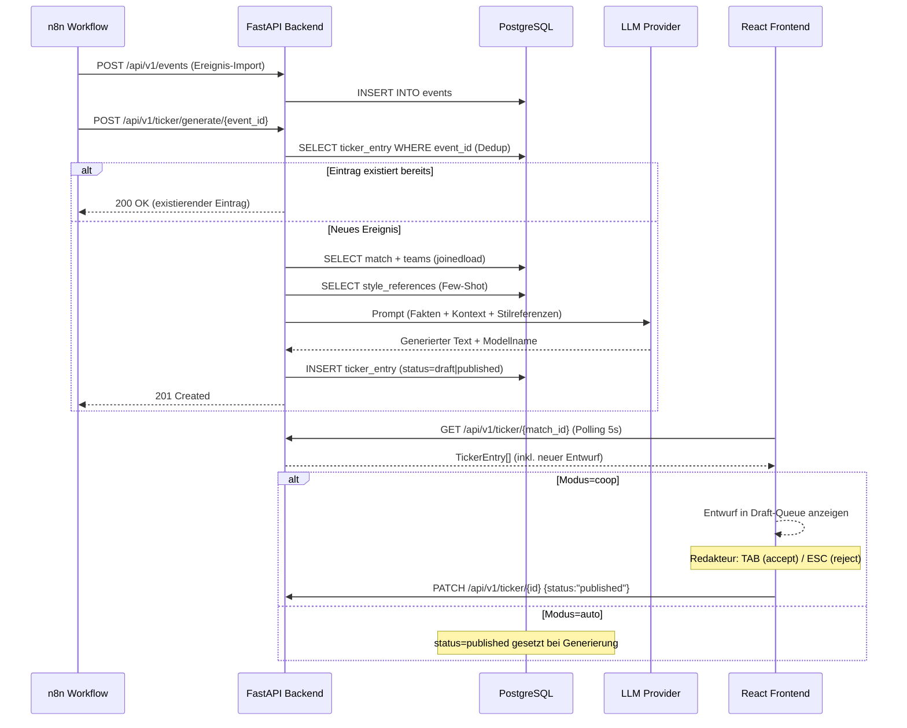
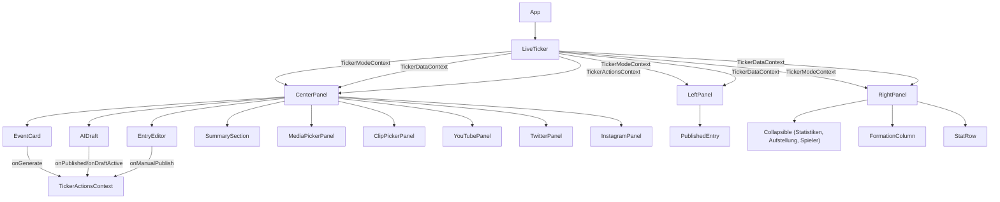

# Kapitel 5 – Implementierung

---

## 5.1 Überblick und Implementierungsstrategie

Dieses Kapitel dokumentiert die konkrete Umsetzung des in Kapitel 4 konzipierten Systems. Im Fokus stehen die technischen Entscheidungen auf Code-Ebene: die interne Struktur des FastAPI-Backends mit seinen Schichten aus Modellen, Repositories, Services und Routern; die KI-Generierungspipeline von der Ereigniserkennung bis zum Ticker-Eintrag; sowie die Frontend-Implementierung mit React, Context-basiertem Zustandsmanagement und dem slash-command-getriebenen Eingabesystem. Ergänzend werden die TypeScript-Migration und die Testabdeckung als Qualitätsmerkmale des Entwicklungsprozesses dokumentiert.

Die Implementierung folgt dem Grundsatz **„so einfach wie nötig, so modular wie sinnvoll"**: Standardpfade (CRUD, Listabfragen) sind bewusst direkt gehalten (Router → Repository), während die LLM-Generierung mit ihren Retry-, Semaphore- und Few-Shot-Mechanismen in einen dedizierten Service extrahiert ist.

---

## 5.2 Backend-Implementierung

### 5.2.1 Projektstruktur

Das Backend ist unterhalb von `backend/app/` in sieben funktionale Pakete gegliedert:

```
backend/app/
├── api/v1/          # HTTP-Router (FastAPI)
├── models/          # SQLAlchemy ORM-Modelle (17 Dateien)
├── repositories/    # Datenbankzugriff (je Entität eine Klasse)
├── schemas/         # Pydantic-Schemas (Request / Response)
├── services/        # Fachliche Services (llm_service, ticker_service)
├── utils/           # Hilfsmodule (llm_context_builders, evaluation_metrics)
└── core/            # Konfiguration, Datenbankverbindung, Enums, Konstanten
```

Diese Aufteilung entspricht dem klassischen Repository-Service-Router-Muster: Router delegieren an Repositories für einfache CRUD-Operationen und an Services für Logik, die mehrere Repositories oder externe Aufrufe koordiniert.

---

### 5.2.2 Application Entry Point und Router-Registrierung

`app/main.py` ist der einzige Einstiegspunkt. Er registriert alle Router, konfiguriert CORS-Middleware und bindet statische Dateien (Thumbnail-Cache) ein. Alle inhaltlichen Endpunkte erhalten den Pfad-Prefix `/api/v1`; der WebSocket-Endpunkt `/ws/media` wird ohne diesen Prefix eingehängt, da er kein REST-Ressourcenpfad ist.

```python
app = FastAPI(
    title="Liveticker AI Backend",
    version="0.3.0",
    docs_url="/api/docs",
)
PREFIX = "/api/v1"
app.include_router(countries.router,          prefix=PREFIX)
app.include_router(teams.router,              prefix=PREFIX)
app.include_router(teams.assignment_router,   prefix=PREFIX)  # POST /seasons/{id}/competitions/{id}/teams/{id}
app.include_router(seasons.router,            prefix=PREFIX)
app.include_router(competitions.router,       prefix=PREFIX)
app.include_router(matches.router,            prefix=PREFIX)
app.include_router(events.router,             prefix=PREFIX)
app.include_router(ticker.router,             prefix=PREFIX)
app.include_router(players.router,            prefix=PREFIX)
app.include_router(clips.router,              prefix=PREFIX)
app.include_router(media.router,              prefix=PREFIX)
app.include_router(media.ws_router)           # /ws/media – kein API-Prefix
```

Beim Start führt `Base.metadata.create_all(bind=engine)` ein idempotentes Schema-Bootstrapping durch, das bei erstmaliger Inbetriebnahme alle Tabellen anlegt. Im Produktionsbetrieb werden Schema-Änderungen via Alembic-Migrationen gesteuert.

Die Anwendung stellt zwei Metaendpunkte bereit:

| Endpunkt      | Funktion                                         |
| ------------- | ------------------------------------------------ |
| `GET /`       | Statusantwort mit Version (`0.3.0`)              |
| `GET /health` | Datenbankverbindungscheck (`healthy`/`degraded`) |

---

### 5.2.3 Datenbankmodelle (SQLAlchemy ORM)

Das Schema umfasst **17 ORM-Modelle** (18 Datenbanktabellen, davon eine via Migration). Die zentralen Domänenobjekte sind:

| Modell            | Tabelle             | Kernfelder                                               |
| ----------------- | ------------------- | -------------------------------------------------------- |
| `Country`         | `countries`         | `id`, `name`, `uid`                                      |
| `Team`            | `teams`             | `id`, `uid`, `name`, `external_id`, `is_partner_team`    |
| `Competition`     | `competitions`      | `id`, `title`, `season_id`                               |
| `Match`           | `matches`           | `id`, `uid`, `match_state`, `match_phase`, `ticker_mode` |
| `Event`           | `events`            | `id`, `match_id`, `event_type`, `time`, `description`    |
| `SyntheticEvent`  | `synthetic_events`  | `id`, `match_id`, `type`, `data` (JSONB)                 |
| `TickerEntry`     | `ticker_entries`    | → siehe unten                                            |
| `Lineup`          | `lineups`           | `player_id`, `status`, `formation_place`, `position`     |
| `MatchStatistic`  | `match_statistics`  | 19 typisierte Spalten (Pässe, Zweikämpfe, Schüsse…)      |
| `PlayerStatistic` | `player_statistics` | `player_id`, `rating`, `goals`, `assists`, …             |
| `StyleReference`  | `style_references`  | `event_type`, `instance`, `league`, `text` (Few-Shot)    |
| `MediaQueue`      | `media_queue`       | `media_id`, `thumbnail_url`, `event_id`, `status`        |
| `MediaClip`       | `media_clips`       | `source`, `vid`, `thumbnail_url`, `match_id`             |

Das `TickerEntry`-Modell hat besondere Bedeutung im Lifecycle des Systems:

```python
class TickerEntry(Base):
    __tablename__ = "ticker_entries"

    id                = Column(Integer, primary_key=True)
    match_id          = Column(Integer, ForeignKey("matches.id", ondelete="CASCADE"))
    event_id          = Column(Integer, ForeignKey("events.id",  ondelete="SET NULL"))
    synthetic_event_id= Column(Integer, ForeignKey("synthetic_events.id", ondelete="SET NULL"))
    text              = Column(Text,   nullable=False)
    style             = Column(String(50))   # neutral / euphorisch / kritisch
    icon              = Column(String(50))
    llm_model         = Column(String(100))
    status            = Column(SAEnum(TickerStatus))  # draft / published / rejected
    source            = Column(SAEnum(TickerSource))  # ai / manual
    minute            = Column(Integer)
    phase             = Column(String(50))
    image_url         = Column(Text)
    video_url         = Column(Text)
    created_at        = Column(TIMESTAMP(timezone=True), server_default=func.now())
```

Drei zusammengesetzte Indizes optimieren die häufigsten Abfragen:

```python
Index("ix_ticker_match_status", "match_id", "status"),   # publizierte Einträge je Spiel
Index("ix_ticker_match_phase",  "match_id", "phase"),    # Phase-Filter
Index("ix_ticker_event_id",     "event_id"),             # Dedup-Check per Event
```

Das Status-Enum `TickerStatus` (`draft`, `published`, `rejected`) wird als nicht-nativ gespeichert (`native_enum=False`), damit Migrationen ohne Enum-Typ-Änderungen in PostgreSQL auskommen.

---

### 5.2.4 Pydantic-Schemas und API-Validierung

Für jeden Router gibt es eigenständige Pydantic-Schemas für Create-, Update- und Response-Strukturen. Alle Schemas nutzen `alias_generator=to_camel` aus `pydantic.alias_generators`, damit JSON-Payloads in camelCase kommuniziert werden, während Python-intern snake_case gilt.

Ein spezifisches Beispiel illustriert die Alias-Mechanik für Match-Scores:

```python
class MatchResponse(BaseModel):
    home_score: Optional[int] = Field(None, serialization_alias="teamHomeScore")
    away_score: Optional[int] = Field(None, serialization_alias="teamAwayScore")
```

Hier wird `serialization_alias` (nicht `alias`) verwendet, da das Frontend die Partner-API-Feldnamen erwartet (`teamHomeScore`/`teamAwayScore`), während Schreiboperationen über `populate_by_name=True` auch den Python-Namen akzeptieren.

Für den Match-Status-Lifecycle definiert `MatchUpdate` ein explizites Alias:

```python
match_state: Optional[MatchState] = Field(None, alias="state")
```

Für Ticker-Einträge wird der Status über ein separates PATCH-Schema gesteuert, um versehentliche Massenänderungen durch offene Update-Schemas zu vermeiden.

---

### 5.2.5 Repository-Schicht

Jede Entität hat ein dediziertes Repository, das alle SQL-Operationen kapselt. Repositories sind einfache Klassen ohne Vererbungshierarchie; jede Instanz erhält eine `Session` im Konstruktor:

```python
class TickerEntryRepository:
    def __init__(self, db: Session):
        self.db = db

    def get_by_event(self, event_id: int) -> Optional[TickerEntry]:
        return self.db.query(TickerEntry).filter(
            TickerEntry.event_id == event_id
        ).first()

    def get_by_match(self, match_id: int, status=None) -> list[TickerEntry]:
        ...
```

Diese Kapselung hat zwei Vorteile: Router bleiben frei von ORM-Details, und Repository-Methoden können direkt mit echten Datenbanken in Integrationstests geprüft werden — ohne Mock-Schichten, die Implementierungsabweichungen verbergen.

Das `MatchRepository` enthält eine spezialisierte Methode `load_with_teams()`, die Heimteam, Auswärtsteam und Wettbewerb per `joinedload` in einer einzigen Datenbankabfrage lädt:

```python
def load_with_teams(self, match_id: int) -> Optional[Match]:
    return self.db.query(Match).options(
        joinedload(Match.home_team),
        joinedload(Match.away_team),
        joinedload(Match.competition),
    ).filter(Match.id == match_id).first()
```

Diese Methode wird von der KI-Generierungsroute intensiv genutzt, da für jeden Aufruf vollständige Kontext-Daten (Teamnamen, Wettbewerb) benötigt werden.

---

### 5.2.6 API-Router: Endpunktstruktur

Der Ticker-Bereich ist in drei Router aufgeteilt, die gemeinsam unter `/api/v1/ticker` eingehängt werden:

| Router            | Datei                | Kernoperationen                                              |
| ----------------- | -------------------- | ------------------------------------------------------------ |
| `ticker_crud`     | `ticker_crud.py`     | GET list, GET single, PATCH status, DELETE, POST manual      |
| `ticker_generate` | `ticker_generate.py` | POST generate/{event_id}, generate-synthetic, generate-batch |
| `ticker_batch`    | `ticker_batch.py`    | POST translate-batch, generate-match-phases                  |

Diese Aufteilung verhindert, dass eine einzelne Routerdatei durch die Kombination aus CRUD-, Generierungs- und Batch-Endpunkten unübersichtlich wird.

Die wichtigsten Endpunkte (Auswahl der 70+ implementierten Routen):

```
GET    /api/v1/teams/countries
GET    /api/v1/teams/by-country/{country}
GET    /api/v1/matches
POST   /api/v1/matches
GET    /api/v1/matches/{id}
PATCH  /api/v1/matches/{id}
DELETE /api/v1/matches/{id}
PATCH  /api/v1/matches/{id}/ticker-mode
PUT    /api/v1/matches/{id}/lineup
PATCH  /api/v1/matches/{id}/statistics
GET    /api/v1/events/{match_id}
POST   /api/v1/events
GET    /api/v1/ticker/{match_id}
POST   /api/v1/ticker/manual
PATCH  /api/v1/ticker/{id}
DELETE /api/v1/ticker/{id}
POST   /api/v1/ticker/generate/{event_id}
POST   /api/v1/ticker/generate-synthetic
POST   /api/v1/ticker/generate-synthetic-batch/{match_id}
POST   /api/v1/ticker/generate-match-phases/{match_id}
POST   /api/v1/ticker/translate-batch/{match_id}
POST   /api/v1/media/incoming
GET    /api/v1/media/queue
POST   /api/v1/media/publish
POST   /api/v1/clips/import
GET    /api/v1/clips/match/{match_id}
POST   /api/v1/clips/{clip_id}/publish
GET    /api/v1/players
POST   /api/v1/players
WS     /ws/media
```

Ergänzend existieren CRUD-Endpunkte für Stammdaten (Countries, Seasons, Competitions, Players) sowie weitere Hilfsrouten (Lineup-Abruf, Spielerstatistiken, Verletzungen, Live-Synchronisation), die hier aus Platzgründen nicht einzeln aufgeführt werden.

---

### 5.2.7 Ticker-Service: Domänenlogik

Der `ticker_service` kapselt die Domänenlogik für KI-Einträge. Er koordiniert Datenbankabfragen, Kontextaufbau und den LLM-Aufruf, hält dabei aber die Schichten klar getrennt: `llm_service.py` hat keine Datenbankabhängigkeit.

Die vier zentralen Funktionen:

**`score_at_event()`** berechnet den Spielstand zum Zeitpunkt eines Torereignisses. Da die Football-API den kumulativen Stand liefert, muss der Stand _vor_ dem aktuellen Event rekonstruiert werden. Die Funktion lädt alle Tore bis zur `position` des Events, unterscheidet zwischen regulären Toren und Eigentoren und akkumuliert die Scores für Heim- und Auswärtsteam:

```python
def score_at_event(event_repo, event, match) -> Optional[str]:
    goals = event_repo.get_goals_up_to(
        match.id, position=event.position, event_id=event.id
    )
    home_score = away_score = 0
    for g in goals:
        d = json.loads(g.description or "{}")
        tid = d.get("team_id")
        if g.event_type == "own_goal":
            # Eigentor → zählt für Gegner
            if tid == home_ext: away_score += 1
            elif tid == away_ext: home_score += 1
        else:
            if tid == home_ext: home_score += 1
            elif tid == away_ext: away_score += 1
    return f"{home_score}:{away_score}"
```

**`build_match_context()`** erstellt das Kontext-Dictionary für den LLM-Prompt: Teamnamen, aktueller Stand, Matchzustand, Spielminute und Liga.

**`call_llm()`** ist der zentrale, Semaphore-gesicherte LLM-Aufruf. Er lädt zunächst aus dem `StyleReferenceRepository` bis zu drei Stilbeispiele für `event_type + instance + league` als Few-Shot-Kontext und delegiert dann an `generate_ticker_text()`:

```python
async with _llm_semaphore:   # asyncio.Semaphore(settings.LLM_CONCURRENCY)
    return await generate_ticker_text(
        event_type=event_type,
        style_references=style_references,  # aus DB geladen
        ...
    )
```

Die Semaphore ist auf Modulebene als Singleton definiert (`_llm_semaphore = asyncio.Semaphore(settings.LLM_CONCURRENCY)`, Standard: 8) und begrenzt gleichzeitige LLM-Aufrufe pro Prozessinstanz.

**`make_ai_entry()`** ist ein schlanker Builder, der aus den LLM-Ergebnissen ein `TickerEntryCreate`-Schema erzeugt. Er setzt `source="ai"` und legt den initialen Status abhängig vom Aufrufkontext fest (`draft` im Co-op-Modus, `published` im Auto-Modus).

---

### 5.2.8 LLM-Service: Prompt-Aufbau und Provider-Dispatch

Der `LLMService` ist eine single-class-Implementierung, die beim Initialisieren den passenden Client instanziiert und über ein Dispatch-Dictionary aufruft:

```python
dispatch = {
    "mock":       self._generate_mock_text,
    "gemini":     self._generate_gemini_text,
    "openrouter": self._generate_openrouter_text,
    "openai":     self._generate_openai_text,
    "anthropic":  self._generate_anthropic_text,
}
return dispatch[self.provider](**kwargs)
```

Das Dispatch-Pattern macht es trivial, neue Provider hinzuzufügen: Implementierung einer Methode `_generate_X_text()` und ein Eintrag im Dictionary.

Der Prompt wird in vier modularen Methoden aufgebaut:

**`_build_event_lines()`** erzeugt die Fakten-Sektion. Jeder Parameter (Ereignistyp, Detail, Minute, Spieler, Team) wird nur dann eingebunden, wenn er vorhanden ist. Die Ereignisbezeichnung wird aus `EVENT_TYPE_LABEL` in lesbares Deutsch übersetzt (z. B. `"goal"` → `"Tor"`).

**`_build_few_shot_block()`** formatiert die Stilreferenzen als nummerierte Beispiele:

```
### STILREFERENZEN
Schreibe in exakt diesem Stil (Rhythmus, Wortwahl, Emotionalität):
- "Mustermann trifft mit einem satten Rechtsschuss – 1:0!"
- "Eintracht schlägt zu – der erste Treffer des Abends!"
```

**`_build_prematch_parts()`** ergänzt für Pre-Match-Typen eine zusätzliche harte Instruktion: Das Modell darf keine Live-Szenen erfinden, sondern ausschließlich Vorschau- und Analyseinhalte produzieren.

Der vollständig zusammengesetzte System-Prompt enthält somit:

1. Rollen- und Stilinstruktion (`Du bist ein {style}-Liveticker-Redakteur`)
2. Faktenblock (Ereignistyp, Minute, Spieler, Team)
3. Match-Kontext (Spielstand, Teams, Liga)
4. Optional: Prematch-Instruktion
5. Few-Shot-Block (0–3 Stilreferenzen)
6. Regel-Block (Zeichenlimit, kein Markdown, Sprache)

LLM-Parameter: `temperature=0.3` für konsistente Ausgaben, `max_tokens` aus `LLM_MAX_TOKENS` (konfigurierbar). Bei Rate-Limit-Fehlern oder transienten Ausnahmen werden bis zu `LLM_RETRY_ATTEMPTS` (3) Versuche mit Backoff `30 s / 60 s` unternommen.

**Normalisierung des Event-Typs** erfolgt vorab in `_normalize_event_type()`. Die `EVENT_TYPE_MAP` übersetzt externe Strings (Partner-API: `PartnerGoal`, Football-API: `Goal`) auf interne Bezeichner (`goal`). Nicht erkannte Typen fallen auf `"comment"` zurück.

---

### 5.2.9 WebSocket-Endpunkt für Media-Queue

Der WebSocket-Endpunkt `/ws/media` wird durch einen dedizierten `MediaConnectionManager` verwaltet:

```python
class MediaConnectionManager:
    def __init__(self):
        self.active: list[WebSocket] = []

    async def connect(self, ws: WebSocket):
        await ws.accept()
        self.active.append(ws)

    async def broadcast(self, message: dict):
        for ws in self.active[:]:
            try:
                await ws.send_json(message)
            except Exception:
                self.active.remove(ws)
```

Wenn das Backend neue Media-Queue-Einträge über `POST /api/v1/media/incoming` erhält, ruft der Router anschließend `manager.broadcast({"type": "new_media", "items": [...]})` auf. Alle verbundenen Clients erhalten das Update in Echtzeit. Der Manager hält Verbindungen in einer einfachen In-Memory-Liste, was für die aktuelle Nutzung (wenige gleichzeitige Redakteur-Clients) ausreichend ist; bei Multi-Prozess-Deployments wäre ein externes Pub/Sub-System (z. B. Redis) erforderlich.

---

## 5.3 KI-Generierungspipeline

### 5.3.1 Ablaufdiagramm

Die folgende Darstellung zeigt den vollständigen Ablauf von einem neuen Live-Ereignis bis zum publizierten Ticker-Eintrag:



---

### 5.3.2 Deduplizierung

Ein zentrales Qualitätsmerkmal der Pipeline ist die Deduplizierung: Der Generierungsendpunkt prüft vor jedem LLM-Aufruf, ob bereits ein Ticker-Eintrag für die `event_id` existiert:

```python
existing = ticker_repo.get_by_event(event_id)
if existing:
    return existing  # Idempotenter Rückgabepfad ohne LLM-Aufruf
```

Dies macht den Endpunkt idempotent gegenüber Mehrfachaufrufen — ein wichtiges Merkmal, da n8n-Workflows bei Fehlern automatisch wiederholen. Ohne diese Prüfung würde jeder Retry einen zusätzlichen Ticker-Eintrag mit unterschiedlichem (nicht-deterministischem) Text erzeugen.

---

### 5.3.3 Statusentscheidung und Modus-Steuerung

Der initiale Status des erzeugten Ticker-Eintrags hängt vom Aufrufparameter `auto_publish` ab, den n8n aus dem `ticker_mode` des Spiels ableitet:

```python
status=TickerStatus.published if data.auto_publish else TickerStatus.draft
```

Im Auto-Modus setzt n8n `auto_publish=True`; der Eintrag ist sofort publiziert. Im Co-op-Modus ist `auto_publish=False` (Standard); der Eintrag wartet als Entwurf auf redaktionelle Freigabe. Dies macht die Modus-Logik zu einem Aufrufparameter des Backends — die Entscheidungsinstanz ist n8n auf Basis des in der Datenbank gespeicherten `ticker_mode`.

---

### 5.3.4 Zustandsautomat der Ticker-Einträge

Das konzeptionelle Statusmodell (`draft` → `published` / `rejected`, Undo-Übergang `published → draft`) ist vollständig in Abschnitt 4.3.2 beschrieben. Implementierungsseitig sind zwei Details hervorzuheben:

Der Übergang `published → draft` (Undo) ist im Frontend als **Toast-Aktion** realisiert: Nach jeder Publikation erscheint für 5 Sekunden ein Widerruf-Button. Über `PATCH /api/v1/ticker/{id}` mit `{ "status": "draft" }` wird der Eintrag zurückgesetzt und steht erneut zur Bearbeitung bereit.

`rejected`-Einträge werden nicht aus der Datenbank gelöscht, sondern behalten ihren Status. Diese Entscheidung sichert die Reproduzierbarkeit der Evaluation: Alle je generierten Einträge — auch verworfene — sind für spätere Qualitätsanalysen auswertbar.

---

## 5.4 Frontend-Implementierung

### 5.4.1 Komponentenhierarchie

Das Frontend ist als React-Anwendung mit TypeScript organisiert. Die Hauptansicht (`LiveTicker`) gliedert sich in drei Panel-Komponenten, die von gemeinsam genutzten Hooks und Contexts gespeist werden:



Die drei Panels sind physisch getrennte React-Komponenten, kommunizieren aber ausschließlich über Context-Provider — kein Prop-Drilling über Komponentengrenzen hinweg.

---

### 5.4.2 React Context-Architektur

Das Frontend verwendet drei spezialisierte Contexts, die in `LiveTicker` zusammengeführt werden. Jeder Context hat eine klar definierte Verantwortung:

**`TickerModeContext`** — Modus-State und Tastatur-Aktionen:

```typescript
interface TickerModeContextValue {
  mode: TickerMode; // "auto" | "coop" | "manual"
  setMode: (mode: TickerMode) => void;
  acceptDraft: () => Promise<void>; // TAB-Shortcut
  rejectDraft: () => Promise<void>; // ESC-Shortcut
}
```

**`TickerDataContext`** — Match-Daten und Reload-Funktionen:

```typescript
interface TickerDataContextValue {
  match: Match | null;
  events: MatchEvent[];
  tickerTexts: TickerEntry[];
  prematch: TickerEntry[];
  lineups: unknown;
  matchStats: unknown;
  players: unknown[];
  playerStats: unknown[];
  injuries: unknown;
  reload: ReloadFunctions;
  generatingId: number | null;
}
```

**`TickerActionsContext`** — Callbacks für redaktionelle Aktionen:

```typescript
interface TickerActionsContextValue {
  onGenerate: (eventId: number, style: TickerStyle) => Promise<void>;
  onManualPublish: (text, icon?, minute?, phase?, rawInput?) => Promise<void>;
  onDraftActive: (id: number, text: string) => void;
  onPublished: (id: number, text: string, isManual?: boolean) => void;
  onEditEntry: (id: number, text: string) => Promise<void>;
  onDeleteEntry: (id: number) => Promise<void>;
  retractedText: string | null;
  clearRetractedText: () => void;
}
```

Die Trennung von Daten- und Aktions-Context hat einen konkreten Performance-Vorteil: Komponenten, die nur Actions konsumieren (z. B. `EntryEditor`), re-rendern nicht bei Änderungen an `tickerTexts`. Dies ist bei einem Live-Ticker mit 5-Sekunden-Polling relevant.

Alle Contexts exportieren zusätzlich einen Hook (`useTickerModeContext`, `useTickerDataContext`, `useTickerActionsContext`), der bei Verwendung außerhalb des Providers einen klaren Fehler wirft — ein Entwicklungssicherheitsnetz.

---

### 5.4.3 Hook-Architektur

Die Zustandslogik ist in zwei Ebenen von Hooks organisiert: gemeinsame Hooks unter `src/hooks/` und feature-spezifische Hooks unter `components/LiveTicker/hooks/`.

Die wichtigsten Hooks und ihre Verantwortlichkeiten:

| Hook                | Paket     | Verantwortlichkeit                                                |
| ------------------- | --------- | ----------------------------------------------------------------- |
| `useNavigation`     | hooks/    | Land→Team→Wettbewerb→Spieltag→Spiel Navigationskette              |
| `useMatchData`      | hooks/    | Polling aller Matchdaten (Match, Events, Ticker, Lineups)         |
| `useMatchTriggers`  | hooks/    | n8n-Webhooks nach Matchauswahl und Statuswechseln                 |
| `useTickerMode`     | hooks/    | `mode`-State, PATCH zum Backend, Keyboard-Shortcuts               |
| `useMediaWebSocket` | hooks/    | WebSocket-Verbindung mit exponentiellem Reconnect-Backoff         |
| `usePanelResize`    | hooks/    | Drag-Resize zwischen Center- und Right-Panel                      |
| `useApiStatus`      | hooks/    | Health-Check gegen Backend (alle 30 s)                            |
| `useTicker`         | LT/hooks/ | Ticker-Actions, Draft-Queue, Publish-Toast (Undo)                 |
| `useEventDraft`     | LT/hooks/ | Entwurfsansicht, Accept/Reject-Logik                              |
| `useAutoPublisher`  | LT/hooks/ | Automatisches Publizieren im Auto-Modus                           |
| `useRightPanelData` | LT/hooks/ | Aufbereitung von Lineups, Stats, Spielerinfo für das rechte Panel |

`useMatchData` steuert das Polling-Intervall über die Hilfsfunktion `resolvePollingInterval()`:

```typescript
// src/utils/resolvePollingInterval.ts
export function resolvePollingInterval(matchState: string | null): number {
  if (matchState === "Live" || matchState === "FullTime") return POLL_EVENTS_MS;   // 5000
  if (matchState == null) return POLL_EVENTS_MS;                                    // 5000
  return POLL_PREMATCH_MS;                                                          // 5000
}
```

Aktuell sind beide Konstanten (`POLL_EVENTS_MS`, `POLL_PREMATCH_MS`) auf 5000 ms gesetzt, sodass alle Zustände mit einem einheitlichen 5-Sekunden-Intervall gepollt werden. Die Unterscheidung ist als Erweiterungspunkt vorgesehen, um bei Bedarf ruhigere Polling-Intervalle für inaktive Spiele einzuführen.

---

### 5.4.4 Slash-Command-Parser (`parseCommand.ts`)

Der Slash-Command-Parser ermöglicht schnelle manuelle Texteingabe ohne Maus-Interaktion. Er übersetzt kurze Kommandos in formatierte Ticker-Texte und liefert Metadaten (Icon, Phase, Minute) für die Publikation.

Die Funktion `parseCommand(input, currentMinute)` gibt ein typisiertes `ParseResult` zurück:

```typescript
export interface ParseResult {
  type: string;
  formatted: string;
  warnings: string[];
  isValid: boolean;
  meta: {
    icon: string;
    phase: string | null;
    minute: number | null;
  };
}
```

**Phasen-Commands** (11 Einträge in `PHASE_CMDS`) erzeugen vordefinierte Texte mit optionaler Minutenangabe:

| Command     | Ausgabe                    | Phase             | Icon |
| ----------- | -------------------------- | ----------------- | ---- |
| `/prematch` | „Vorbericht"               | `Before`          | 📣   |
| `/anpfiff`  | „Anpfiff!"                 | `FirstHalf`       | 📣   |
| `/hz`       | „Halbzeit!"                | `FirstHalfBreak`  | 🔔   |
| `/2hz`      | „Anstoß zur 2. Halbzeit"   | `SecondHalf`      | 📣   |
| `/vz1`      | „Beginn der Verlängerung"  | `ExtraFirstHalf`  | 📣   |
| `/elfmeter` | „Elfmeterschießen beginnt" | `PenaltyShootout` | 🥅   |
| `/abpfiff`  | „Abpfiff!"                 | `After`           | 📣   |

**Event-Commands** (12 Einträge in `CMD_MAP`, 8 Typen nach Expansion) erzeugen strukturierte Texte mit Validierungshinweisen:

```
/g Mustermann EF  → "TOR — Mustermann (EF)"  + icon ⚽
/gelb Müller EF   → "Gelb — Müller (EF)"     + icon 🟨
/rot Huber Bayern → "Rot — Huber (Bayern)"   + icon 🟥
/s EinRaus AusRein EF → "Wechsel — EinRaus ↔ AusRein (EF)" + icon 🔄
/n Freistoß knapp über das Tor → "Freistoß knapp über das Tor"
```

Für unvollständige Eingaben gibt `warnings[]` gezielte Hinweise zurück (`"Fehlend: Spieler"`), die im `EntryEditor` live angezeigt werden. Das Frontend kann damit ohne Backend-Aufruf Validierungsfeedback geben.

Nicht erkannte Commands werden mit `isValid: false` und einer Fehlermeldung zurückgegeben (`"Unbekannter Command: /xyz"`), statt einen Laufzeitfehler zu werfen.

---

### 5.4.5 WebSocket-Hook (`useMediaWebSocket`)

Der `useMediaWebSocket`-Hook verwaltet die Lebensdauer der WebSocket-Verbindung zum Backend. Die Kernentscheidung ist das **exponentielle Reconnect-Backoff**:

```typescript
const delay = Math.min(
  BASE_DELAY_MS * 2 ** retryCountRef.current, // 1s → 2s → 4s → 8s → …
  MAX_DELAY_MS, // max 30s
);
```

Der `retryCountRef` zählt aufeinanderfolgende Verbindungsabbrüche. Bei erfolgreicher Reconnection wird er auf 0 zurückgesetzt. `BASE_DELAY_MS = 1000`, `MAX_DELAY_MS = 30_000`.

Ein `mountedRef` verhindert Zustandsänderungen nach dem Unmounten der Komponente — ein häufiges React-Problem bei asynchronen Operationen:

```typescript
ws.onclose = () => {
  if (!mountedRef.current) return; // Kein setState nach Unmount
  // … retry-Logik
};
```

Der Cleanup im `useEffect` setzt `ws.onclose = null`, bevor die WebSocket geschlossen wird. Ohne diesen Schritt würde das `close`-Event des kontrollierten Schließens einen unbeabsichtigten Reconnect-Versuch auslösen.

---

### 5.4.6 Modusimplementierung im Frontend

Der aktive Modus (`auto` / `coop` / `manual`) steuert das Verhalten mehrerer Frontend-Komponenten. Die Implementierung verteilt sich auf drei Ebenen:

**Persistenz und Synchronisation** — `useTickerMode` initialisiert den Modus lokal mit `auto` als Standardwert und schreibt Änderungen über `PATCH /matches/{id}/ticker-mode` an das Backend zurück. Lokale Optimistic-Updates vermeiden wahrnehmbare Latenz beim Umschalten.

**Keyboard-Shortcuts** — Im Co-op-Modus registriert `useTickerMode` die Shortcuts `TAB` (acceptDraft) und `ESC` (rejectDraft) direkt als Keyboard-Event-Listener. Im Auto- und Manual-Modus sind diese Shortcuts nicht aktiv. Die Shortcut-Registrierung ist an den Modus-Zustand gebunden und wird bei Moduswechsel automatisch aktualisiert.

**`useAutoPublisher`** — Im Auto-Modus überwacht dieser Hook die `tickerTexts` auf neue Draft-Einträge (`status="draft"`) und publiziert sie automatisch. Dies ist als Frontend-Fallback gedacht: Primär setzt n8n mit `auto_publish=True` den Status direkt beim Generieren; `useAutoPublisher` fängt Fälle auf, in denen das nicht geschehen ist.

**Modus-Umschalter** — Der `ModeSelector` rendert einen Portal-basierten Bestätigungsdialog, um unbeabsichtigte Moduswechsel während eines Live-Spiels zu verhindern. Eine Toast-Meldung (2200 ms sichtbar) bestätigt den Wechsel. Keyboard-Shortcuts `Ctrl+1` / `Ctrl+2` / `Ctrl+3` ermöglichen direkten Zugriff.

---

## 5.5 TypeScript-Migration

Das Frontend wurde im Verlauf des Projekts von reinem JavaScript auf TypeScript migriert. Ziel war nicht die vollständige Auflösung aller `any`-Typen, sondern eine pragmatische Typisierung der systemkritischen Pfade mit messbaren Qualitätskennzahlen.

**Migrationsstrategie** — Die Migration folgte einem schrittweisen Ansatz: Zuerst wurden alle `.js`- und `.jsx`-Dateien in `.ts` und `.tsx` umbenannt, dann `tsconfig.json` konfiguriert. Anschließend wurden TypeScript-Fehler von innen nach außen behoben — beginnend mit dem Typ-System (`src/types/index.ts`) über Contexts bis zu den Komponenten. Der `strict`-Modus ist derzeit deaktiviert (`"strict": false`), um die inkrementelle Migration ohne blockierende Fehlereskalation zu ermöglichen.

**Zentrale Typ-Definitionen** — `src/types/index.ts` definiert die gemeinsamen Domain-Interfaces:

```typescript
export type TickerMode = "auto" | "coop" | "manual";
export type TickerStyle = "neutral" | "euphorisch" | "kritisch";
export type MatchPhase = "Before" | "FirstHalf" | "FirstHalfBreak" | "SecondHalf" | ...;

export interface TickerEntry {
  id: number;
  match_id: number;
  event_id?: number | null;
  text: string;
  style?: string | null;
  status: "draft" | "published" | "rejected";
  source?: "ai" | "manual";
  minute?: number | null;
  phase?: string | null;
  icon?: string | null;
  image_url?: string | null;
  video_url?: string | null;
  llm_model?: string | null;
}
```

**Ergebnis** — Nach der Migration erzielt das Projekt **0 TypeScript-Compilerfehler** und eine **type-coverage von 91,33 %** (gemessen mit `type-coverage --strict`). Die detaillierte Darstellung der Migrationsergebnisse und die Analyse der verbleibenden untypisierten Stellen folgt in Kapitel 6.6.

---

## 5.6 Qualitätssicherung und Tests

Die Qualitätssicherung folgt dem Testpyramiden-Modell nach Cohn (2009) mit drei Ebenen: Unit-Tests, Integrations-Tests und End-to-End-Tests. Insgesamt umfasst die Testsuite **391 Tests** (187 Frontend, 198 Backend, 6 E2E), die alle grün durchlaufen.

**Frontend-Tests** — Das Frontend verwendet Jest mit `@testing-library/react` für 187 Tests in 15 Dateien. Besonders umfangreich getestet ist der `parseCommand`-Parser (45 Testfälle), da er die kritische manuelle Eingabeschicht bildet.

**Backend-Tests** — Das Backend nutzt pytest mit FastAPI `TestClient` und transaktionalem Rollback für 198 Tests bei 75 % Statement-Coverage. Die Integrations-Tests prüfen API-Endpunkte gegen eine PostgreSQL-Testdatenbank.

**End-to-End-Tests** — Sechs Playwright-Tests validieren den stabilen Kern der Browser-Anwendung: korrektes Rendern, Fehlerfreiheit beim Laden und grundlegende Interaktionspunkte.

Die detaillierte Auswertung aller Testmetriken, Coverage-Verteilungen und konkreten Testbeispiele folgt in Kapitel 6.2–6.5.

---

## 5.7 n8n Workflow-Implementierung

Die n8n-Workflows bilden die Orchestrierungsschicht zwischen externen Datenquellen, dem FastAPI-Backend und dem LLM-Dienst. Alle 15 Workflow-Dateien liegen als versionierte JSON-Exporte im Projektverzeichnis `n8n/` vor und können direkt in eine n8n-Instanz importiert werden. Dieser Abschnitt dokumentiert die Implementierungsdetails der fünf zentralen Workflows.

---

### 5.7.1 Events-LLM-Workflow (`09_events_llm_workflow.json`)

Der Workflow `09` ist der kritischste im System: Er importiert Live-Ereignisse, persistiert sie und triggert für jedes neue Ereignis die KI-Generierung. Er wird via Webhook (`POST /Events`) mit einer `fixture_id` aufgerufen.

**Instanz- und Stil-Bestimmung**

Als erster Schritt wird per SQL ermittelt, ob das Spiel ein Frankfurt-Spiel ist, und daraus `instance` und `style` abgeleitet:

```sql
SELECT
  CASE WHEN (ht.name ILIKE '%Frankfurt%' OR at.name ILIKE '%Frankfurt%')
       THEN 'ef_whitelabel' ELSE 'generic' END AS instance,
  CASE WHEN (ht.name ILIKE '%Frankfurt%' OR at.name ILIKE '%Frankfurt%')
       THEN 'euphorisch' ELSE 'neutral' END AS style,
  m.id AS match_id,
  m.ticker_mode
FROM matches m
JOIN teams ht ON ht.id = m.home_team_id
JOIN teams at ON at.id = m.away_team_id
WHERE m.external_id = $1::integer
LIMIT 1
```

Das Ergebnis (`ef_whitelabel`/`generic`, `euphorisch`/`neutral`, `ticker_mode`) fließt in alle nachgelagerten LLM-Aufrufe ein.

**Ereignis-Import**

Die Events werden von der Football-API (`/fixtures/events?fixture={id}`) abgerufen. Ein JavaScript-Code-Knoten normalisiert die Ereignistypen:

```javascript
const TYPE_MAP = {
  Goal: "goal",
  Card: "yellow_card", // bzw. 'red_card' wenn detail 'red' enthält
  subst: "substitution",
  Var: "comment",
  Miss: "missed_penalty",
};
```

Der Kontext (Spieler, Team, Details) wird als JSON-Blob in das `description`-Feld gespeichert. Die UPSERT-Strategie verhindert Duplikate durch eine `source_id` im Format `apifootball_{fixture_id}_{minute}_{type}_{player_id}`:

```sql
INSERT INTO events (match_id, time, event_type, description, source, source_id)
VALUES (...)
ON CONFLICT (source_id) WHERE source_id IS NOT NULL
DO NOTHING
RETURNING id, event_type, time, description
```

**LLM-Trigger**

Nur Events mit einer zurückgegebenen `id` (erfolgreich insert, nicht Konflikt) passieren einen `Filter`-Knoten und triggern den Backend-Endpunkt:

```http
POST /api/v1/ticker/generate/{event_id}
{
  "style": "euphorisch",       ← aus instance/style-Abfrage
  "instance": "ef_whitelabel",
  "language": "de",
  "auto_publish": true          ← ticker_mode === 'auto'
}
```

`auto_publish` wird direkt aus `ticker_mode` abgeleitet: `ticker_mode === 'auto'` → `true`, sonst `false`.

**Torjubel-Video-Pipeline (EF-spezifisch)**

Für Frankfurt-Torereignisse läuft ein dedizierter Zweig: Der Workflow liest Spielerdaten von `profis.eintracht.de/page-data/kader/page-data.json`, baut S3-Video-URLs aus Spieler-IDs auf (Format: `000/492/931` aus neunstellig aufgefüllter ID) und aktualisiert das Backend:

```sql
UPDATE players
SET image_url = $1, video_url = $2, updated_at = NOW()
WHERE jersey_number = $3
  AND team_id IN (SELECT id FROM teams WHERE name ILIKE '%Frankfurt%')
RETURNING id, display_name, jersey_number, video_url
```

Anschließend wird ein Ticker-Eintrag mit der Video-URL erzeugt — im Co-op-Modus als `draft`, im Auto-Modus direkt als `published`. Dies ermöglicht das Einbetten von Torjubel-Videos direkt in den Ticker.

---

### 5.7.2 Prematch-Import-Workflow (`07_import_prematch.json`)

Workflow `07` baut den Vorberichtskontext aus fünf parallelen Football-API-Abfragen auf:

| Datenquelle            | API-Endpunkt                                            |
| ---------------------- | ------------------------------------------------------- |
| Verletzungen           | `/injuries?fixture={id}`                                |
| Head-to-Head           | `/fixtures/headtohead?h2h={home}-{away}`                |
| Teamstatistiken (Heim) | `/teams/statistics?league={id}&season={year}&team={id}` |
| Teamstatistiken (Gast) | `/teams/statistics?league={id}&season={year}&team={id}` |
| Tabellenstand          | `/standings?league={id}&season={year}`                  |

Jede Datenquelle erzeugt ein `synthetic_event` mit dem Typ `pre_match_injuries_{team_id}`, `pre_match_h2h`, `pre_match_team_stats_home/away` bzw. `pre_match_standings`. Die Insert-Strategie ist idempotent — bei erneutem Aufruf wird die `data`-Spalte aktualisiert, der Primärschlüssel bleibt stabil:

```sql
WITH ins AS (
  INSERT INTO synthetic_events (match_id, type, data)
  VALUES (
    (SELECT id FROM matches WHERE external_id = $1),
    $2,
    $3::jsonb
  )
  ON CONFLICT (match_id, type) DO UPDATE SET data = EXCLUDED.data
  RETURNING id
)
SELECT ins.id FROM ins
LEFT JOIN ticker_entries te
  ON te.synthetic_event_id = ins.id AND te.status != 'rejected'
WHERE te.id IS NULL
```

Die WHERE-Bedingung am Ende ist ein wichtiges Implementierungsdetail: Das synthetische Event wird nur zurückgegeben (und damit ein LLM-Aufruf getriggert), wenn noch kein nicht-verworfener Ticker-Eintrag für dieses Event existiert. Bereits generierte und eventuell publizierte Texte werden damit nicht erneut überschrieben.

---

### 5.7.3 Matchphasen-Workflow (`14_Game_ANpfiff_ABpfiff.json`)

Workflow `14` verarbeitet Spielzustands-Übergänge (Anpfiff, Halbzeit, Abpfiff etc.) via Webhook (`POST /match-status`). Ein JavaScript-Knoten implementiert eine Übergangsprüfung:

```javascript
const validFromStates = {
  "1H":  ["PreMatch", "ToBeConfirmed", null],
  "HT":  ["Live"],
  "2H":  ["Live"],
  "FT":  ["Live", "FullTime"],
  "ET":  ["Live", "FullTime"],
  "BT":  ["Live"],
  "P":   ["Live"],
  "AET": ["Live", "FullTime"],
  "PEN": ["Live", "FullTime"],
};
```

Ungültige Übergänge (z. B. direkt von `PreMatch` zu `2H`) werden zurückgewiesen. Für Vollzeit-Ereignisse (`FT`, `AET`, `PEN`) generiert der Workflow automatisch die gesamte Phasensequenz rückwirkend — ein `FT`-Signal erzeugt also vier synthetische Events: Anstoß, Halbzeit, 2. Halbzeit, Abpfiff.

Das zentrale SQL-Statement kombiniert drei Operationen in einer einzigen Transaktion:

```sql
WITH upd AS (
  UPDATE matches SET match_state = $1, match_phase = $5, minute = $6
  WHERE id = $2
),
ins AS (
  INSERT INTO synthetic_events (match_id, type, data)
  VALUES ($2, $3, $4::jsonb)
  ON CONFLICT (match_id, type) DO UPDATE SET data = EXCLUDED.data
  RETURNING id, type
),
demote AS (
  -- Bereits publizierte Phase-Einträge auf draft zurückstufen
  UPDATE ticker_entries SET status = 'draft'
  FROM ins
  WHERE ticker_entries.synthetic_event_id = ins.id
    AND ticker_entries.status = 'published'
  RETURNING ticker_entries.synthetic_event_id
)
SELECT ins.id, ins.type FROM ins
LEFT JOIN ticker_entries te ON te.synthetic_event_id = ins.id
  AND te.status = 'draft'
LEFT JOIN demote d ON d.synthetic_event_id = ins.id
WHERE te.id IS NULL AND d.synthetic_event_id IS NULL
```

Die `demote`-CTE ist besonders relevant: Wenn ein Status-Signal erneut gesendet wird (z. B. bei einem Korrektur-Trigger), wird ein bereits publizierter Phasen-Text zurück auf `draft` gesetzt. Damit kann die Redaktion ihn überprüfen, bevor er erneut publiziert wird.

---

### 5.7.4 Halbzeit/Abpfiff-Zusammenfassung (`13_Halftime_aftertime.json`)

Workflow `13` erzeugt narrative Zusammenfassungen für Halbzeit und Abpfiff. Im Gegensatz zu `09` — der das Backend-LLM-Service nutzt — ruft `13` OpenRouter **direkt** auf, da Zusammenfassungen keinen Few-Shot-Stil aus der Datenbank benötigen, sondern einen umfangreicheren Prompt mit Statistiken erfordern.

Der Workflow lädt parallel Ereignisse, Statistiken und Spieler-Ratings von der Football-API, baut daraus einen deutschen Prompt zusammen:

```
Ballbesitz:          61% vs 39%
Schüsse gesamt:       14 vs  8
Schüsse aufs Tor:      5 vs  2
Ecken:                 6 vs  3
Fouls:                12 vs  9
Pässe:              412 (87%) vs 283 (78%)
Bestes Spieler-Rating: Mustermann (8.4), ...

Schreibe einen Halbzeitbericht (2–3 lebhafte Sätze auf Deutsch,
direkte Fansprache).
```

Der LLM-Aufruf geht an OpenRouter (`google/gemini-2.0-flash-lite-001`, `max_tokens: 450`). Das Ergebnis wird über `POST /api/v1/ticker/manual` als manueller Ticker-Eintrag gespeichert — je nach `ticker_mode` direkt als `published` oder als `draft`.

---

### 5.7.5 ScorePlay-Medien-Workflow (`08_scoreplay_media_workflow.json`)

Workflow `08` sucht Medien-Assets bei ScorePlay und übergibt sie an das Backend. Die Spieler-Suche (`GET /v1/tag/search?query={lastName}`) gibt mehrere Treffer zurück; ein JavaScript-Knoten implementiert Fuzzy-Matching mit Normalisierung:

```javascript
// Normalisierung für robusteres Matching
str
  .replace(/[äàáâã]/g, "a")
  .replace(/[ö]/g, "o")
  .replace(/[ü]/g, "u")
  .replace(/ß/g, "ss")
  .replace(/ø/g, "o");
// Abgleich gegen: full_name, first_name, last_name, ai_name
```

Die Mediensuche erfolgt als POST mit strukturiertem Filter-Body:

```json
{
  "media_type": "photo",
  "order_by": "created_at",
  "order_type": "desc",
  "validated_accessible": true,
  "players": [matched_player_id]
}
```

Gefundene URLs (thumbnail, compressed, original) werden gesammelt und an `POST /api/v1/media/incoming` übertragen. Das Backend persistiert sie und sendet sie über `/ws/media` an alle verbundenen Frontend-Clients.

---

### 5.7.6 Implementierungsübergreifende Muster

Über alle Workflows hinweg lassen sich vier Implementierungsmuster identifizieren:

**1. Idempotente UPSERT-Strategie** — Alle Insert-Operationen verwenden `ON CONFLICT DO UPDATE` oder `DO NOTHING`. Als Konfliktschlüssel dienen externe IDs (`source_id`, `external_id`), zusammengesetzte Schlüssel (`match_id, type`) oder Unique-Constraints auf Namensfeldern. Das macht alle Workflows bei Mehrfachausführung sicher.

**2. Filter-vor-Trigger-Muster** — Vor jedem LLM-Trigger steht ein Filter-Knoten, der nur Rows mit einer `id` (erfolgreicher DB-Insert) durchlässt. Events mit `DO NOTHING`-Konflikten (bereits importiert) erzeugen keinen neuen LLM-Aufruf.

**3. Ticker-Mode-Propagation** — `ticker_mode` aus der Datenbank wird in allen Generierungsworkflows als `auto_publish`-Flag an das Backend weitergegeben: `auto_publish = (ticker_mode === 'auto')`. Die Moduslogik sitzt damit vollständig in der Datenbank; n8n liest sie bei jedem Aufruf neu aus.

**4. Instanz-Routing** — Die Unterscheidung zwischen `ef_whitelabel` und `generic` erfolgt per `ILIKE '%Frankfurt%'`-Abfrage auf Teamnamen. Das Ergebnis steuert Stilwahl, Few-Shot-Auswahl im Backend und ob der Torjubel-Video-Pfad aktiviert wird.

---

### 5.7.7 Export zur Stackwork Demo App

Die operative Implementierung ermöglicht den **Export publizierter Ticker-Inhalte** zur bereits existierenden Stackwork Demo App von Eintracht Frankfurt. Die beiden Systeme operieren vollständig getrennt — die Kommunikation erfolgt ausschließlich über HTTP-API-Aufrufe.

**CMS-API-Export-Pipeline** — Zusätzlich zu den fünf dokumentierten Core-Workflows existieren **Export-Workflows**, die publizierte Ticker-Einträge aus der lokalen PostgreSQL-Datenbank lesen und über REST-API-Aufrufe an die CMS-Endpunkte der Stackwork Demo App übertragen. Der Export triggert ereignisgesteuert nach jeder `status=published`-Aktualisierung.

**Manuelle Spielauswahl** — Der Initialisierungsprozess erfordert manuelle Eingabe der Spiel-ID in die n8n-Workflows. Diese bewusste Designentscheidung stellt sicher, dass nur explizit ausgewählte Spiele mit Live-Tickering versehen werden. Nach der Initialisierung erfolgt sowohl die Event-Reaktion als auch der Export vollautomatisch.

**Systemabgrenzung** — Die Demo App ist eine separate, bereits produktive Anwendung mit eigenständiger Codebasis und Infrastruktur. Der Autor hat als Stackwork-Mitarbeiter ausschließlich Zugang zu den **CMS-API-Endpunkten**, nicht zum Quellcode der Demo App. Die n8n-Export-Workflows sind die einzige Verbindung zwischen beiden Systemen.

**Deployment-Isolation** — Die Architektur implementiert bewusst eine **Zwei-System-Strategie**: Das entwickelte KI-Redaktionssystem läuft als eigenständige Anwendung, während die Stackwork Demo App als etablierte End-User-Plattform fungiert. Beide Systeme können unabhängig entwickelt, deployed und skaliert werden.

---

## 5.8 Kritische Würdigung der Implementierung

Die Implementierung realisiert alle drei konzipierten Betriebsmodi funktionsfähig und in einem strukturell stabilen Zustand. Besonders positiv ist die Trennschärfe zwischen den Schichten: llm_service hat keine Datenbankabhängigkeit, Repositories kapseln alle SQL-Details, und die drei Frontend-Contexts vermeiden sowohl Prop-Drilling als auch unnötige Re-Renders.

Vier Aspekte verdienen eine kritische Einordnung:

**Erstens** ist die Provider-Auswahl im LLM-Service als schlüsselbasierte Priorisierung implementiert, nicht als konfigurierbare Laufzeit-Strategie. Für ein Produktionssystem wäre ein expliziterer Konfigurationsmechanismus (z. B. ein Konfigurationsfeld in der Datenbank pro Spiel) robuster.

**Zweitens** enthält der `useAutoPublisher` im Frontend eine semantische Doppelung: Im Auto-Modus publiziert n8n über `auto_publish=True` bereits beim Generieren; der Frontend-Hook fängt Residualfälle auf. Diese Zweispurigkeit entstand durch inkrementelle Entwicklung und könnte in einer Folgeversion auf eine definitive Strategie konsolidiert werden.

**Drittens** existiert die WebSocket-Verbindung als In-Memory-Singleton pro Prozess. Bei einem Multi-Prozess-Deployment (z. B. mehrere Uvicorn-Worker hinter einem Load-Balancer) würden Medien-Updates nur an Clients übermittelt, die mit dem spezifischen Worker verbunden sind. Für den aktuellen Betrieb mit wenigen Redakteurs-Clients ist dies unproblematisch; eine Redis-Pub/Sub-Erweiterung wäre die natürliche Skalierungsstufe.

**Viertens** ist der `strict`-Modus in `tsconfig.json` derzeit deaktiviert. Dies war ein pragmatischer Kompromiss, um die inkrementelle TypeScript-Migration ohne blockierende Fehlerflut zu ermöglichen. Eine schrittweise Aktivierung von `strict`-Teilregeln (z. B. `noImplicitAny`, `strictNullChecks`) wäre ein sinnvoller nächster Schritt zur weiteren Härtung der Codebasis.

**Fünftens** ist die Few-Shot-Infrastruktur vollständig implementiert — der Scraping-Workflow befüllt `style_references` mit echten EF-Liveticker-Texten, `StyleReferenceRepository.get_samples()` lädt sie mit liga-spezifischer Suche und automatischem Fallback, und `_build_few_shot_block()` bettet sie in den Prompt ein. In der Praxis greifen jedoch zwei Einschränkungen: (a) Die Demo-App-Workflows (`13_Halftime_aftertime.json`) rufen OpenRouter direkt auf und umgehen das Backend-LLM-Service, sodass Few-Shot dort nicht wirksam wird. (b) Der Liga-Filter schlägt wegen eines Case-Mismatches (`style_references.league = "bundesliga"` vs. `competition.title = "Bundesliga"`) immer fehl und fällt auf die liga-agnostische Suche zurück. Beide Punkte sind behebbar, beeinträchtigen aber die grundsätzliche Funktionsfähigkeit der Stilgenerierung nicht.

Insgesamt belegen die Metriken — 0 TypeScript-Fehler, 91,33 % type-coverage, 187 Frontend-Tests, 198 Backend-Tests mit 75 % Coverage, 6 E2E-Tests — einen konsistenten Qualitätsanspruch, der über den Rahmen eines typischen akademischen Projekts hinausgeht.
